# **Section 1: Design Identity, Governance, and Monitoring Solutions**

Section 1 of the Azure Solutions Architect Expert journey focuses on the critical foundational elements required for any secure, compliant, well-managed, and observable cloud environment. Mastering identity and access management, establishing robust governance, and implementing comprehensive monitoring are paramount before deploying significant workloads. This section covers how to translate business requirements for security, compliance, cost control, and operational visibility into effective Azure solutions using Microsoft Entra ID, Azure Policy, Azure Cost Management, and Azure Monitor.

---

## **1.1 Design Identity and Access Management (IAM)**

Designing the identity strategy is often the first step in Azure adoption. It involves managing user identities, controlling access to resources, and ensuring secure authentication and authorization mechanisms are in place. Microsoft Entra ID (formerly Azure Active Directory) is the core service for these capabilities.

### **1.1.1 Microsoft Entra ID Fundamentals**

Microsoft Entra ID is Microsoft's cloud-based identity and access management service. It helps employees sign in and access resources in external resources (like Microsoft 365, Azure portal, SaaS apps) and internal resources (like apps on your corporate network).

*   **Concepts:**
    *   **Tenant:** A dedicated and trusted instance of Microsoft Entra ID, automatically created when an organization signs up for a Microsoft cloud service subscription. It represents the organization.
    *   **Users:** Identities representing people (Members) or guests (Guest users from other tenants or consumer accounts) needing access.
    *   **Groups:** Collections of users or other principals used to simplify access management (assigning permissions to groups instead of individuals). Types include Security groups (for managing access) and Microsoft 365 groups (for collaboration features + access). Membership can be Assigned (manual) or Dynamic (rule-based based on user attributes).
    *   **Service Principals:** An identity created for applications, hosted services, and automated tools to access Azure resources. Think of it as a "user identity" (username and password or certificate) for an application.
    *   **App Registrations:** Defines an application within Entra ID, allowing it to authenticate and call APIs. Creates an Application object and a corresponding Service Principal object in the home tenant.

*   **Authentication Methods:** How users prove their identity.
    *   **Password Hash Synchronization (PHS):** (Most common for hybrid) Hashes of on-premises AD user passwords are synced to Entra ID. Users authenticate directly against Entra ID using the same password. Requires Entra Connect Sync.
    *   **Pass-Through Authentication (PTA):** User password validation happens directly against on-premises AD using lightweight agents. No password hashes stored in the cloud. Requires Entra Connect Sync and PTA agents.
    *   **Federation (e.g., ADFS):** Entra ID redirects authentication to a trusted external Identity Provider (IdP) like Active Directory Federation Services (ADFS). Requires managing a separate federation infrastructure.
    *   **Passwordless:** Methods like FIDO2 security keys, Microsoft Authenticator app sign-in, Windows Hello for Business.

*   **Multi-Factor Authentication (MFA):** Adds a layer of security by requiring two or more verification methods.
    *   **Methods:** Something you know (password), something you have (Authenticator app, token, phone call, SMS), something you are (biometrics - via Windows Hello).
    *   **Enforcement:** Can be enabled per-user (legacy, not recommended), through security defaults (basic free MFA for admins/all users), or ideally via **Conditional Access policies**.
    *   **Features:** Number Matching (prevents accidental approval), Trusted IPs/Named Locations (bypass MFA from known locations), Remember MFA on trusted devices.

*   **Conditional Access (CA) Policies:** The core policy engine in Entra ID Premium to enforce organizational access requirements. Acts as an "If-Then" statement.
    *   **Assignments (If):** Define the scope - Users/Groups, Cloud Apps, Conditions (Sign-in Risk, User Risk, Device Platform, Location, Client Apps, Device State - Compliant/Hybrid Joined).
    *   **Access Controls (Then):** Define the action - Block access, Grant access but require MFA, Compliant Device, Hybrid Joined Device, Approved Client App, App Protection Policy, Password Change, Terms of Use.

*   **Single Sign-On (SSO):** Enables users to sign in once and access multiple applications and services without re-authenticating. Entra ID acts as the central IdP. Supports SAML 2.0, OpenID Connect (OIDC), OAuth 2.0 protocols. Configured via Enterprise Applications.

**Diagram 1.1.1.A: Entra ID Tenant Structure & Authentication Flow**
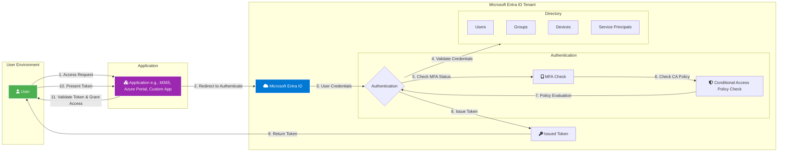

**Diagram 1.1.1.B: Conditional Access Policy Logic**
```mermaid
graph TD
    Start(Sign-in Attempt) --> ConditionCheck{Evaluate Conditions?};

    subgraph Conditions [Assignments IF]
      CondUserGroup[User/Group Membership?]
      CondApp[Target Cloud App?]
      CondLocation[Location IP/GPS?]
      CondDevice[Device State Compliant/Hybrid?]
      CondClientApp[Client App Browser/Mobile/Legacy?]
      CondRisk[Sign-in/User Risk Detected?]
    end

    ConditionCheck -- Yes --> CondUserGroup;
    CondUserGroup --> CondApp;
    CondApp --> CondLocation;
    Location --> CondDevice;
    CondDevice --> CondClientApp;
    CondClientApp --> CondRisk;

    CondRisk -- Conditions Met --> ControlCheck{Evaluate Controls?};
    CondRisk -- Conditions Not Met --> AllowAccessGrant Access - No Policy Match;

    subgraph Controls [Access Controls THEN]
        direction LR
        Grant[Grant Access]
        Block[Block Access]
        subgraph Grant Requirements
            ReqMFA[Require MFA]
            ReqCompliant[Require Compliant Device]
            ReqHybrid[Require Hybrid Joined Device]
            ReqApp[Require Approved Client App]
            ReqTerms[Require Terms of Use]
            ReqPassword[Require Password Change]
        end
    end

    ControlCheck -- Grant Path --> Grant;
    Grant --> ReqMFA;
    Grant --> ReqCompliant;
    Grant --> ReqHybrid;
    Grant --> ReqApp;
    Grant --> ReqTerms;
    Grant --> ReqPassword;

    ControlCheck -- Block Path --> Block;

    ReqMFA --> AccessGrantedAccess Granted with Controls;
    ReqCompliant --> AccessGranted;
    ReqHybrid --> AccessGranted;
    ReqApp --> AccessGranted;
    ReqTerms --> AccessGranted;
    ReqPassword --> AccessGranted;
    Block --> AccessBlockedAccess Blocked;

    style Start fill:#2196F3,color:#FFF
    style AllowAccess fill:#4CAF50,color:#FFF
    style AccessGranted fill:#4CAF50,color:#FFF
    style AccessBlocked fill:#F44336,color:#FFF
```

**Comparison Table 1.1.1.C: Authentication Methods (PHS vs. PTA vs. Federation)**

| Feature             | Password Hash Sync (PHS)                     | Pass-Through Auth (PTA)                       | Federation (e.g., ADFS)                     |
| :------------------ | :------------------------------------------- | :-------------------------------------------- | :------------------------------------------ |
| **Password Storage**| Hash stored in Entra ID                      | No password/hash stored in Entra ID           | No password/hash stored in Entra ID         |
| **Validation**      | Entra ID validates hash                      | On-premises AD validates via PTA Agent        | On-premises IdP (ADFS) validates            |
| **Infrastructure**  | Entra Connect Sync                           | Entra Connect Sync + PTA Agent(s)             | Entra Connect Sync + Federation Server(s)   |
| **Complexity**      | Low                                          | Medium (Agents required)                      | High (Requires managing Federation infra)   |
| **On-Prem Dependency**| Low (Only for sync)                        | High (Agents need connectivity to DCs)        | High (Federation servers must be reachable) |
| **User Experience** | Seamless Cloud Auth                          | Seamless Cloud Auth                           | Redirect to IdP login page                  |
| **Offline Access**  | Cloud auth works if on-prem AD is down       | Cloud auth fails if Agents/DCs are down       | Cloud auth fails if IdP is down             |
| **Use Case**        | Most common, simplest hybrid identity        | Org policy prohibits password hashes in cloud | Complex security needs, existing IdP        |

### **1.1.2 Azure Role-Based Access Control (RBAC)**

Azure RBAC provides fine-grained access management for Azure resources, enabling you to grant only the amount of access that users need to perform their jobs (Principle of Least Privilege).

*   **Concepts:**
    *   **Security Principal:** An object representing a user, group, service principal, or managed identity that is requesting access to Azure resources.
    *   **Role Definition:** A collection of permissions (e.g., `Microsoft.Compute/virtualMachines/start/action`). It lists the operations that can be performed (Actions), operations that cannot be performed (NotActions), and data operations (DataActions/NotDataActions for storage, etc.). Roles can be Built-in (provided by Azure, e.g., Owner, Contributor, Reader, VM Contributor) or Custom (created by you).
    *   **Scope:** The boundary to which the access applies. Can be set at four levels: Management Group (highest), Subscription, Resource Group, or individual Resource.
    *   **Role Assignment:** The process of attaching a role definition to a security principal at a particular scope. This grants the access.

*   **Inheritance:** Permissions are inherited from parent scopes. A role assigned at a Management Group scope grants those permissions to all subscriptions, resource groups, and resources within it.
*   **Deny Assignments:** Take precedence over role assignments. Currently, only created by Azure (e.g., via Blueprints or Managed Apps) to protect resources. You cannot create custom deny assignments directly.

**Diagram 1.1.2.A: Azure RBAC Hierarchy and Inheritance**
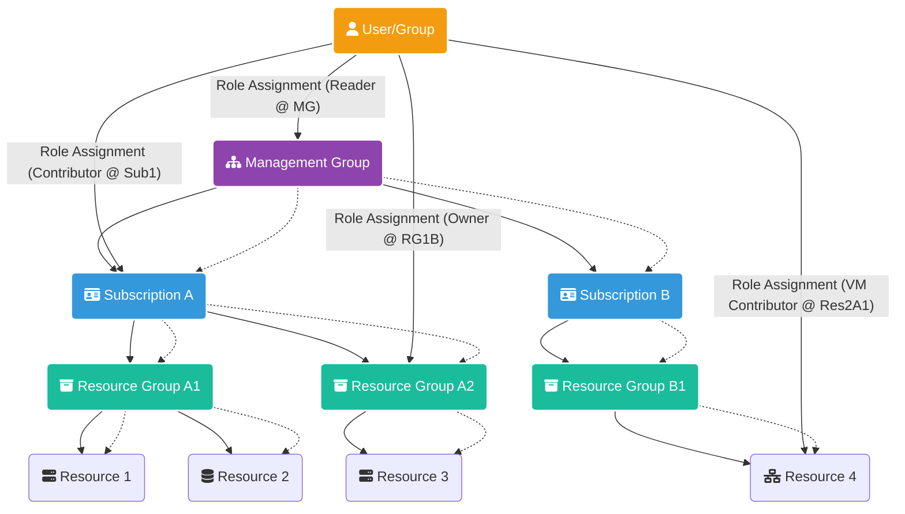
*Note: Dashed arrows indicate inheritance. Solid arrows indicate role assignments.*

**Diagram 1.1.2.B: RBAC Assignment Components**
```mermaid
graph LR
    Principal[fa:fa-user Security Principal <br/> (User, Group, SPN, MI)]
    RoleDef[fa:fa-book Role Definition <br/> (e.g., Contributor)]
    Scope[fa:fa-crosshairs Scope <br/> (MG, Sub, RG, Resource)]

    Principal -- Is Assigned --> Assignment((fa:fa-link Role Assignment));
    RoleDef -- Defines Permissions For --> Assignment;
    Scope -- Applied At --> Assignment;

    style Principal fill:#F39C12,color:#FFF
    style RoleDef fill:#3498DB,color:#FFF
    style Scope fill:#1ABC9C,color:#FFF
    style Assignment fill:#2C3E50,color:#FFF
```

### **1.1.3 Privileged Identity Management (PIM)**

PIM is an Entra ID Premium P2 service that enables you to manage, control, and monitor access to important resources. This includes managing privileged access for roles in Entra ID and Azure resources.

*   **Concepts:**
    *   **Eligible Assignment:** User must activate the role before using it. Activation may require MFA, justification, or approval. Reduces risk of standing privileges.
    *   **Active Assignment:** Traditional role assignment, user has permissions immediately (like standard RBAC). Used less often for privileged roles with PIM.
    *   **Just-in-Time (JIT) Access:** Users get temporary permissions to perform privileged tasks only when needed.
    *   **Time-Bound Access:** Assignments (Eligible or Active) can have start and end dates.
    *   **Approval Workflows:** Require designated approvers to authorize role activation requests.
    *   **Access Reviews:** Recurrent reviews where users or designated reviewers must attest to the continued need for role assignments. Helps clean up unnecessary access.
    *   **Alerts & Audit Logs:** Provides visibility into privileged access activity and potential misuse.

*   **Use Cases:** Securely managing Global Administrators, Subscription Owners, Contributor roles, etc. Enforcing least privilege for administrative tasks. Meeting compliance requirements for privileged access control.

**Diagram 1.1.3.A: PIM Activation Workflow (Eligible Assignment)**
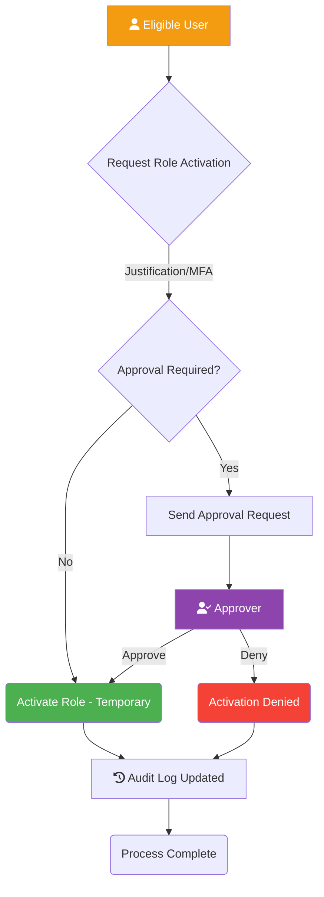

### **1.1.4 Managed Identities**

Managed identities provide an identity for applications to use when connecting to resources that support Microsoft Entra authentication, without needing to manage any credentials (like passwords or secrets) in code or configuration.

*   **Types:**
    *   **System-assigned:** Created as part of an Azure resource (e.g., VM, App Service, Function App). Its lifecycle is tied directly to that resource; deleting the resource deletes the identity. Cannot be shared.
    *   **User-assigned:** Created as a standalone Azure resource. Can be assigned to one or more Azure resources. Its lifecycle is managed independently. Useful for scenarios where multiple resources need the same identity or for pre-provisioning identity before resource creation.

*   **Authentication Flow:**
    1.  An Azure resource (e.g., VM) with a managed identity enabled needs to access another Azure service (e.g., Key Vault).
    2.  The resource's code requests an access token from the local Azure Instance Metadata Service (IMDS) endpoint (a non-routable IP address accessible only from within the VM/service).
    3.  IMDS communicates with Entra ID to obtain an OAuth 2.0 access token for the resource's managed identity.
    4.  IMDS returns the access token to the requesting resource.
    5.  The resource uses the obtained token in the Authorization header when calling the target Azure service API.
    6.  The target service validates the token and authorizes the request based on the RBAC roles assigned to the managed identity on that target service.

*   **Use Cases:** Securely accessing Key Vault, Storage Accounts, Azure SQL Database, Azure Resource Manager API, etc., from Azure compute services without embedding credentials.

**Diagram 1.1.4.A: Managed Identity Authentication Flow**
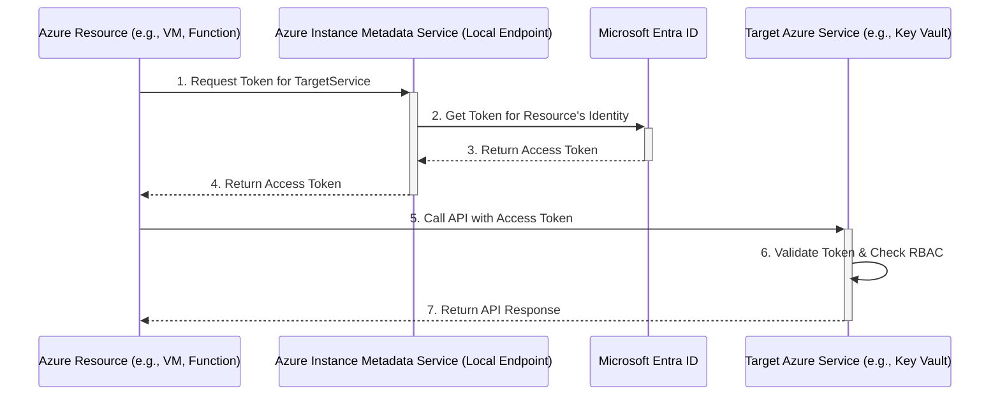

**Comparison Table 1.1.4.B: System-assigned vs. User-assigned Managed Identities**

| Feature         | System-assigned Managed Identity        | User-assigned Managed Identity          |
| :-------------- | :-------------------------------------- | :-------------------------------------- |
| **Creation**    | Enabled on an Azure resource instance   | Created as a standalone Azure resource  |
| **Lifecycle**   | Tied to the Azure resource              | Managed independently                   |
| **Sharing**     | Cannot be shared (1:1 with resource)    | Can be assigned to multiple resources   |
| **Use Case**    | Workloads contained within a single resource | Scenarios requiring shared identity, pre-provisioning |
| **ARM Template**| Part of the resource definition         | Separate resource definition            |

### **1.1.5 Entra ID Identity Protection**

Identity Protection is a tool that allows organizations to detect potential vulnerabilities affecting user identities, configure automated responses to detected suspicious actions, and investigate suspicious incidents. Requires Entra ID Premium P2.

*   **Risk Detection:** Uses Microsoft's intelligence (heuristics, machine learning) to detect risk signals.
    *   **User Risk:** Probability that a user account has been compromised (e.g., Leaked credentials found online, sign-ins from anomalous locations/infected devices).
    *   **Sign-in Risk:** Probability that a specific sign-in attempt is not authorized by the identity owner (e.g., Anonymous IP address, Impossible travel, Unfamiliar sign-in properties, Malware linked IP).

*   **Policies:** Automated responses integrated with Conditional Access.
    *   **User Risk Policy:** Targets users deemed "at risk". Common action: Require secure password reset.
    *   **Sign-in Risk Policy:** Targets sign-in attempts deemed "at risk". Common action: Require MFA or Block access.

*   **Reporting & Investigation:** Provides reports on risky users, risky sign-ins, and risk detections for investigation.

**Diagram 1.1.5.A: Identity Protection Risk Detection & Remediation Flow**
```mermaid
graph TD
    subgraph Detection
        Behavior(User Sign-in / Behavior) --> RiskEngine{Microsoft Threat Intelligence & ML Engine};
        RiskEngine -- Detects --> UserRisk[User Risk (e.g., Leaked Creds)];
        RiskEngine -- Detects --> SignInRisk[Sign-in Risk (e.g., Impossible Travel)];
    end

    subgraph PolicyEnforcement
        UserRisk --> UserPolicy{User Risk Policy Check};
        SignInRisk --> SignInPolicy{Sign-in Risk Policy Check};

        UserPolicy -- High Risk --> U_Remediate[Remediate User Risk (e.g., Force Password Reset via CA)];
        UserPolicy -- Medium/Low Risk --> U_Monitor[Monitor / Require MFA via CA];
        UserPolicy -- No Match --> Continue1;

        SignInPolicy -- High Risk --> S_Block[Block Sign-in via CA];
        SignInPolicy -- Medium/Low Risk --> S_Remediate[Remediate Sign-in Risk (e.g., Require MFA via CA)];
        SignInPolicy -- No Match --> Continue2;
    end

    subgraph Investigation
        UserRisk --> Reports(Reports & Investigation);
        SignInRisk --> Reports;
        U_Remediate --> Reports;
        S_Block --> Reports;
        S_Remediate --> Reports;
    end

    Continue1 --> End(Access Allowed/Further Checks);
    Continue2 --> End;
    U_Remediate --> End;
    U_Monitor --> End;
    S_Block --> End;
    S_Remediate --> End;

    style RiskEngine fill:#E74C3C, color:#FFF
    style UserPolicy fill:#3498DB, color:#FFF
    style SignInPolicy fill:#3498DB, color:#FFF
```

### **1.1.6 External Identities**

Entra ID provides capabilities to securely interact with users outside your organization.

*   **B2B Collaboration:** Allows you to invite guest users (using their own credentials from their home tenant or other IdPs) to collaborate on your organization's resources (e.g., SharePoint sites, Teams, Azure resources). Access is managed via RBAC/application permissions. Cross-tenant access settings provide granular control over inbound/outbound collaboration. Entitlement Management can bundle resources into Access Packages for streamlined B2B onboarding and governance.
*   **B2C (Azure AD B2C):** A separate Customer Identity Access Management (CIAM) service, typically run in a dedicated B2C tenant. Designed for customer-facing applications. Allows customers to sign up, sign in, and manage their profiles using local accounts (email/username + password) or social/enterprise identity providers (Facebook, Google, SAML IdPs). Highly customizable user journeys via User Flows or Custom Policies (Identity Experience Framework).

**Comparison Table 1.1.6.A: Entra ID vs. B2B vs. B2C**

| Feature             | Microsoft Entra ID (Workforce) | B2B Collaboration (Guest Users) | Azure AD B2C (Customer Identity) |
| :------------------ | :----------------------------- | :------------------------------ | :------------------------------- |
| **Primary Purpose** | Manage employee/internal access | Collaborate with external partners | Manage customer identities/access |
| **Tenant Model**    | Organization's primary tenant  | Guests exist in primary tenant  | Separate, dedicated B2C tenant   |
| **User Types**      | Members                        | Guests                          | Consumers (Local, Social, Federated) |
| **Identity Providers**| Entra ID, On-prem AD (Hybrid)  | Guest's Home Entra ID, Email OTP, Google, etc. | Local Accounts, Google, Facebook, SAML/OIDC IdPs |
| **Customization**   | Limited UI branding            | Limited UI branding             | Highly customizable UI/User Journeys |
| **Pricing**         | Per User (Free, P1, P2 tiers)  | First 50k MAU free, then tiered | Per Monthly Active User (MAU) & Authentication |
| **Use Case**        | Employee access to M365/Azure/Apps | Sharing resources with partners | Customer login for retail/public apps |

---

## **1.2 Design Governance**

Governance in Azure involves establishing policies, processes, and tools to manage resources effectively, ensure compliance, control costs, and maintain security posture across the environment.

### **1.2.1 Azure Policy**

Azure Policy helps enforce organizational standards and assess compliance at scale. It evaluates resources for non-compliance with assigned policies.

*   **Components:**
    *   **Policy Definition:** A JSON file describing resource compliance rules (e.g., allowed locations, required tags, allowed VM SKUs, required security settings). Contains the logic (if/then conditions) and the effect.
    *   **Initiative Definition (Policy Set):** A collection of related policy definitions grouped together to achieve a larger goal (e.g., "Enable Monitoring in Azure Security Center" initiative might contain policies for installing agents, enabling diagnostics, etc.). Simplifies assignment.
    *   **Assignment:** Applying a policy or initiative definition to a specific scope (Management Group, Subscription, Resource Group). Parameters can be specified during assignment (e.g., the specific tag name to enforce). A Managed Identity can be assigned for policies with `DeployIfNotExists` or `Modify` effects to grant permissions for remediation.
    *   **Exemption:** Allows specific resources or scopes to be excluded from policy evaluation for a defined reason and duration.

*   **Effects:** Determine what happens when the policy rule is matched.
    *   `Audit`: Creates a warning event in the Activity Log but doesn't stop the action. Good for assessing compliance.
    *   `AuditIfNotExists`: Audits if a related resource (e.g., diagnostic setting) doesn't exist.
    *   `Deny`: Blocks the resource creation or update action if it violates the policy.
    *   `DeployIfNotExists`: Deploys a related resource (e.g., Log Analytics agent) if it's missing after resource creation/update. Requires a Managed Identity.
    *   `Modify`: Adds or updates properties/tags on resources during creation or update (e.g., adding a cost center tag). Requires a Managed Identity.
    *   `Append`: Adds fields to a resource during creation/update (less common than Modify).
    *   `Disabled`: Disables the policy assignment.

*   **Use Cases:** Cost control (restricting expensive SKUs), Security (enforcing encryption, network rules), Compliance (meeting regulatory requirements), Tagging enforcement, Resource consistency.
*   **Policy vs. RBAC:** Policy controls *what* can be done with resources (properties, configurations), while RBAC controls *who* can perform actions on resources. They are complementary.

**Diagram 1.2.1.A: Azure Policy Enforcement Flow**
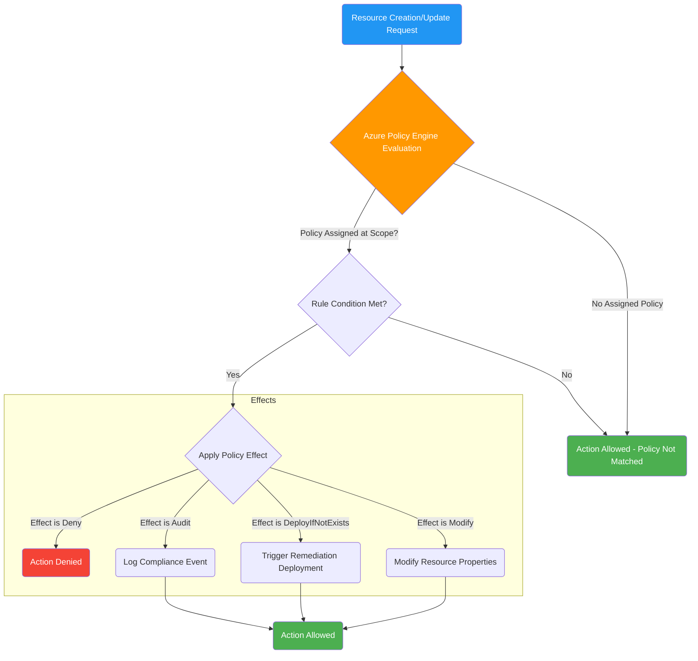

**Diagram 1.2.1.B: Policy Initiative Structure**
```mermaid
graph LR
    subgraph Initiative Definition ["fa:fa-list-alt Initiative: Enforce Security Standards"]
        PolicyDef1[fa:fa-file-alt Policy Def: Allowed Locations]
        PolicyDef2[fa:fa-file-alt Policy Def: Require NSG on Subnets]
        PolicyDef3[fa:fa-file-alt Policy Def: Enforce HTTPS on App Service]
        PolicyDef4[fa:fa-file-alt Policy Def: Audit VMs without Antimalware]
    end

    Initiative -- Assigned To --> Scope[fa:fa-crosshairs Scope (MG/Sub/RG)];

    style Initiative fill:#8E44AD,color:#FFF
    style PolicyDef1 fill:#3498DB,color:#FFF
    style PolicyDef2 fill:#3498DB,color:#FFF
    style PolicyDef3 fill:#3498DB,color:#FFF
    style PolicyDef4 fill:#3498DB,color:#FFF
    style Scope fill:#1ABC9C,color:#FFF
```

### **1.2.2 Resource Organization & Tagging**

A well-defined hierarchy and consistent tagging strategy are crucial for managing costs, applying governance policies, and organizing resources logically.

*   **Hierarchy:**
    *   **Management Groups (MGs):** Containers to organize subscriptions. Policies and RBAC assignments at the MG level are inherited by all subscriptions within it. Allows structuring based on organizational needs (e.g., Geography, Business Unit, Prod/Dev). A root MG exists above all others.
    *   **Subscriptions:** A unit of management, billing, and scale. Resources are deployed within subscriptions. Acts as a boundary for policies, RBAC, and Azure limits.
    *   **Resource Groups (RGs):** Containers holding related resources for an application or workload. Resources within an RG typically share the same lifecycle (deployed, managed, and deleted together). Resources can only exist in one RG.

*   **Subscription Design Models:** Common strategies include:
    *   **By Application:** Each major application gets its own subscription. Good isolation, clear ownership, but can lead to many subscriptions.
    *   **By Environment:** Separate subscriptions for Production, Development, Testing, Staging. Good isolation between environments.
    *   **By Business Unit:** Subscriptions aligned with organizational departments. Clear billing/chargeback.
    *   **By Geography:** For data residency or regional management needs.
    *   **Hybrid:** Combining models (e.g., BU -> Prod/Dev subscriptions).

*   **Tagging Strategy:** Applying metadata (key-value pairs) to resources for organization, cost tracking, automation, and reporting.
    *   **Common Tags:** `Environment` (Prod/Dev/Test), `CostCenter`, `Owner`, `ApplicationName`, `Project`, `DataClassification`.
    *   **Enforcement:** Use Azure Policy to require specific tags on resources or resource groups, or to inherit tags from RGs/Subscriptions (using Modify effect).
    *   **Usage:** Filtering resources in the portal, grouping costs in Azure Cost Management, triggering automation scripts.

**Diagram 1.2.2.A: Azure Resource Hierarchy (Detailed Tree Diagram)**
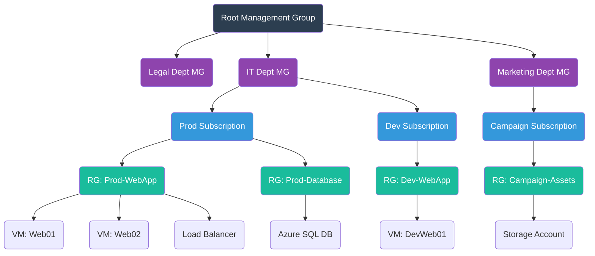

**Decision Tree 1.2.2.B: Choosing a Subscription Model**
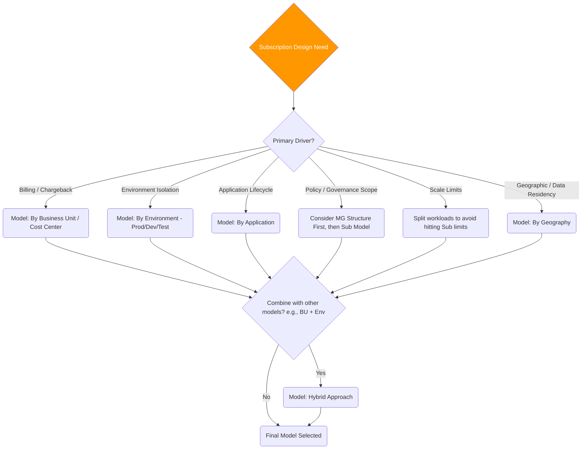

### **1.2.3 Cost Management and Optimization**

Azure Cost Management + Billing provides tools to monitor, allocate, and optimize Azure costs.

*   **Tools:**
    *   **Cost Analysis:** Explore and analyze costs using various filters (Timeframe, Scope, Subscription, RG, Tag, Resource Type, etc.) and groupings. Visualize spending trends.
    *   **Budgets:** Set spending thresholds (monthly, quarterly, annually) at different scopes. Trigger alerts (email, Action Group) when thresholds are forecasted or actually met.
    *   **Alerts:** Besides budget alerts, configure alerts for credit usage, invoice thresholds, etc.
    *   **Azure Advisor:** Provides personalized recommendations for optimizing resources across Cost, Security, Reliability, Operational Excellence, and Performance. Cost recommendations include right-sizing, shutting down idle resources, purchasing Reservations/Savings Plans.
    *   **Cost Exports:** Schedule recurring exports of detailed usage/cost data to an Azure Storage account for offline analysis or integration with other tools (e.g., Power BI).

*   **Optimization Levers:** Strategies to reduce Azure spend.
    *   **Right-sizing:** Selecting appropriate VM sizes, database tiers, storage performance tiers based on actual utilization, not just peak load. Use Azure Monitor metrics and Advisor.
    *   **Decommissioning:** Identifying and deleting unused resources (unattached disks, old snapshots, idle VMs, empty RGs).
    *   **Azure Hybrid Benefit (AHB):** Use existing on-premises Windows Server and SQL Server licenses with Software Assurance (or subscriptions) to pay a reduced rate (base compute cost) for corresponding Azure services (VMs, SQL DB/MI, AKS).
    *   **Reservations:** Commit to specific Azure resources (VMs, SQL DB/MI compute, Cosmos DB RU/s, Storage capacity, Software plans, etc.) for a 1-year or 3-year term to receive significant discounts compared to pay-as-you-go. Best for stable, predictable workloads. Less flexible.
    *   **Savings Plans for Compute:** Commit to a fixed hourly spend on compute services across various regions and instance types for a 1-year or 3-year term. Discounts are automatically applied to matching usage up to the commitment. More flexible than Reservations for compute.
    *   **Spot VMs:** Utilize Azure's spare compute capacity at very large discounts (up to 90%). Workloads can be evicted with little notice, suitable for fault-tolerant, interruptible tasks (batch jobs, dev/test, stateless apps).
    *   **Storage Optimization:** Using appropriate Blob access tiers (Hot/Cool/Cold/Archive) and Lifecycle Management policies. Choosing correct redundancy levels. Cleaning up old snapshots/backups.
    *   **Scheduling:** Shutting down non-production resources (VMs, DevTest Labs) during off-hours using automation (Azure Automation, Logic Apps, VM Start/Stop solution).

**Diagram 1.2.3.A: Cost Management Workflow**
```mermaid
graph TD
    subgraph Usage & Billing
        Usage(Azure Resource Usage) --> Metering(Metering Engine)
        Metering --> Rating(Rating Engine - Applies Pricing)
        Rating --> Invoice(Monthly Invoice)
    end

    subgraph Cost Management Cycle
        CostAnalysis[fa:fa-chart-bar Cost Analysis (Portal/API)] --> Monitor(Monitor Spending Trends)
        Monitor --> Budgets[fa:fa-bullseye Set Budgets & Alerts]
        Budgets -- Threshold Met --> AlertAction[fa:fa-bell Trigger Alert / Action Group]
        Monitor --> Advisor[fa:fa-lightbulb Review Advisor Recommendations]
        Advisor --> Optimization(Implement Optimization Levers)
        Optimization --> Usage
        CostAnalysis --> Exports[fa:fa-download Schedule Cost Exports to Storage]
        Exports --> OfflineAnalysis[Offline Analysis / Power BI]
    end

    Usage --> CostAnalysis

    style Usage fill:#1ABC9C,color:#FFF
    style Invoice fill:#2C3E50,color:#FFF
    style CostAnalysis fill:#3498DB,color:#FFF
    style Budgets fill:#F39C12,color:#FFF
    style Advisor fill:#9B59B6,color:#FFF
    style Optimization fill:#4CAF50,color:#FFF
```

**Comparison Table 1.2.3.B: Reservations vs. Savings Plans vs. Spot VMs vs. AHB**

| Feature             | Reservations                                  | Savings Plans (Compute)                       | Spot VMs                                      | Azure Hybrid Benefit (AHB)                  |
| :------------------ | :-------------------------------------------- | :-------------------------------------------- | :-------------------------------------------- | :------------------------------------------ |
| **Commitment**      | 1 or 3 years (Specific VM type/region/etc.)   | 1 or 3 years (Hourly $ amount for compute)    | None (Pay current Spot price)                 | Requires eligible on-prem licenses (SA/Sub) |
| **Discount**        | High (up to 72% vs PAYG)                      | High (up to 65% vs PAYG)                      | Very High (up to 90% vs PAYG)                 | Significant (Removes OS/SQL license cost)   |
| **Flexibility**     | Lower (Scope/Instance flexibility options exist) | Higher (Applies across regions/VM families) | None (Can be evicted anytime)                 | High (Can be applied/removed)               |
| **Applies To**      | VMs, SQL, Cosmos, Storage, Software, etc.     | Most Azure Compute services (VMs, AKS, ACI, Functions Premium, App Service Dedicated) | VMs, VM Scale Sets                            | Windows Server VMs, SQL VMs/DB/MI, AKS      |
| **Use Case**        | Stable, predictable workloads                 | Dynamic compute workloads needing commitment  | Interruptible, fault-tolerant workloads       | Customers with existing eligible licenses   |
| **Risk**            | Underutilization if workload changes          | Underutilization if spend drops below commit  | Eviction risk                                 | License compliance                          |

---

## **1.3 Design Monitoring**

Azure Monitor is the unified platform for collecting, analyzing, and acting on telemetry data from Azure and on-premises environments. Effective monitoring is crucial for maintaining application health, performance, and availability.

### **1.3.1 Azure Monitor Overview**

*   **Data Sources:** Applications (via Application Insights SDK), Operating Systems (via Azure Monitor Agent), Azure Resources (Platform logs/metrics), Azure Subscription (Activity Log), Azure Tenant (Entra ID Logs), Custom Sources (APIs).
*   **Data Types:**
    *   **Metrics:** Numerical values collected at regular intervals describing some aspect of a system at a particular time (e.g., CPU %, Request Count, Latency). Stored in a time-series database.
    *   **Logs:** Event data, traces, performance data organized into records with different properties. Collected by Log Analytics. Queried using KQL. Examples: Application logs, VM event logs, Syslog, Activity Log, Diagnostic settings output.
    *   **Traces:** Distributed tracing data showing the path of a request across multiple services (collected by Application Insights).
    *   **Changes:** Information about Azure resource changes (collected in Activity Log).

*   **Core Capabilities:**
    *   **Analyze:** Query logs (Log Analytics), visualize metrics (Metrics Explorer), monitor applications (Application Insights), create interactive reports (Workbooks).
    *   **Respond:** Trigger alerts based on metrics/logs/activity log, automate actions using Action Groups (Notifications, Webhooks, Functions, Logic Apps, etc.). Autoscaling based on metrics.
    *   **Visualize:** Pin charts to Azure Dashboards, create rich reports with Workbooks, use Power BI, Grafana connectors.
    *   **Integrate:** Export data, connect to SIEM/ITSM tools.

**Diagram 1.3.1.A: Azure Monitor High-Level Architecture**
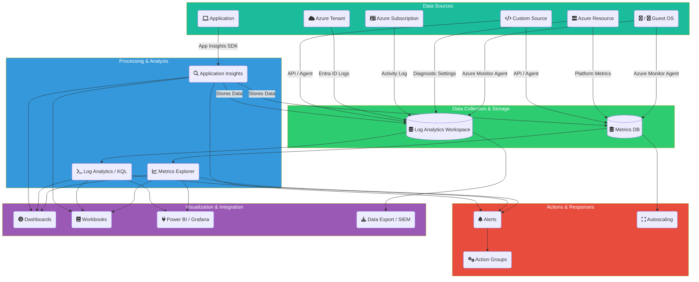

### **1.3.2 Log Analytics**

Log Analytics is the primary tool in Azure Monitor for collecting, correlating, querying, and analyzing log and performance data.

*   **Log Analytics Workspace:** The fundamental container for log data.
    *   **Design:** Consider factors like data sovereignty (workspaces are regional), access control, data retention needs, cost (pricing tiers, data ingestion/retention costs), query scope. Common models: Centralized (one workspace per region/org), Decentralized (per application/team/environment).
    *   **Access Control:** Workspace-context (permissions assigned at workspace level) vs. Resource-context (permissions inherited from resources sending data - requires resource RBAC).
    *   **Data Retention & Archive:** Configure retention period per table (or default), option to archive data beyond retention for lower cost long-term storage.

*   **Agents:**
    *   **Azure Monitor Agent (AMA):** New unified agent replacing legacy agents. Collects data based on Data Collection Rules (DCRs), offering more granular control and efficiency. Supports Windows & Linux. Collects performance counters, event logs, syslog, text logs, IIS logs, etc.
    *   **Legacy Agents:** Log Analytics Agent (MMA/OMS - Windows/Linux), Diagnostics Extension (WAD/LAD - Azure resources). Being deprecated in favor of AMA.

*   **Kusto Query Language (KQL):** Powerful read-only query language used to analyze data in Log Analytics (and other services like Data Explorer, Sentinel). Key verbs: `search`, `where` (filter), `summarize` (aggregate), `project` (select columns), `extend` (calculate columns), `join`, `render` (visualize).

**Diagram 1.3.2.A: Log Analytics Workspace Design Options**
```mermaid
graph TD
    subgraph Centralized Model
        direction LR
        WS_Central[fa:fa-database Central Log Analytics Workspace (Region A)]
        App1(App 1) --> WS_Central;
        App2(App 2) --> WS_Central;
        Infra(Infrastructure) --> WS_Central;
    end

    subgraph Decentralized Model
        direction LR
        WS_App1[fa:fa-database Workspace App 1 (Region A)]
        WS_App2[fa:fa-database Workspace App 2 (Region A)]
        WS_Infra[fa:fa-database Workspace Infra (Region A)]
        App1_Dec(App 1) --> WS_App1;
        App2_Dec(App 2) --> WS_App2;
        Infra_Dec(Infrastructure) --> WS_Infra;
    end

    style WS_Central fill:#2ECC71,color:#FFF
    style WS_App1 fill:#2ECC71,color:#FFF
    style WS_App2 fill:#2ECC71,color:#FFF
    style WS_Infra fill:#2ECC71,color:#FFF
```

**Comparison Table 1.3.2.B: Azure Monitor Agent (AMA) vs. Legacy Agents (MMA/OMS, WAD/LAD)**

| Feature             | Azure Monitor Agent (AMA)                     | Legacy Agents (MMA/OMS, WAD/LAD)              |
| :------------------ | :-------------------------------------------- | :-------------------------------------------- |
| **Configuration**   | Data Collection Rules (DCRs) - Centralized    | Agent config / Portal settings / Templates    |
| **Granularity**     | High (Specific events/counters per DCR)       | Lower (Often all or broad categories)         |
| **Destinations**    | Multiple Log Analytics Workspaces, Metrics    | Typically single LA Workspace, Storage        |
| **Extensibility**   | Designed for future extensions                | Limited                                       |
| **OS Support**      | Windows, Linux                                | Windows, Linux                                |
| **Security**        | Uses Managed Identity (recommended)           | Workspace Key / Connection Strings            |
| **Future Direction**| Strategic agent, replacing legacy agents      | Being deprecated (Aug 2024 target)            |

### **1.3.3 Application Insights**

Application Insights is an Application Performance Management (APM) service for developers and DevOps professionals. It monitors live applications, detects performance anomalies, helps diagnose issues, and understand user activity.

*   **Telemetry:** Automatically collects (via SDK instrumentation) or can be configured to collect:
    *   Request rates, response times, failure rates.
    *   Dependency rates, response times, failure rates (calls to external services like SQL, HTTP APIs).
    *   Exceptions (stack traces).
    *   Page views, load performance (browser telemetry).
    *   AJAX calls.
    *   Performance counters (CPU, Memory, etc.).
    *   Host diagnostics logs (Docker).
    *   Diagnostic trace logs (e.g., Log4Net, NLog, System.Diagnostics.Trace).
    *   Custom events and metrics coded by developers.

*   **Key Features:**
    *   **Application Map:** Visualizes the topology of application components and their dependencies, overlaying performance/failure data.
    *   **Live Metrics Stream:** Real-time view of performance and failure counts.
    *   **Transaction Search:** Find and explore individual request/dependency/exception/trace instances. End-to-end transaction details.
    *   **Failures Blade:** Analyze failed requests, exceptions, dependencies. Grouping by problem type.
    *   **Performance Blade:** Analyze response times for operations and dependencies. Identify bottlenecks.
    *   **Availability Tests:** Monitor application endpoints from global points of presence (URL ping test, Standard (multi-step) test, Custom TrackAvailability test). Trigger alerts on failure/slowness.
    *   **Usage Analysis:** Analyze user behavior (Users, Sessions, Events), create Funnels, Cohorts, User Flows, Retention reports.
    *   **Smart Detection:** Proactive automatic detection of performance and failure anomalies using machine learning.

*   **Deployment:** Typically involves adding an SDK to the application code or using codeless attach for supported services (e.g., App Service, Functions, AKS). Can be Workspace-based (sends data to Log Analytics workspace, enabling cross-querying) or Classic (standalone resource, being deprecated).

**Diagram 1.3.3.A: Application Insights Data Flow & Features**
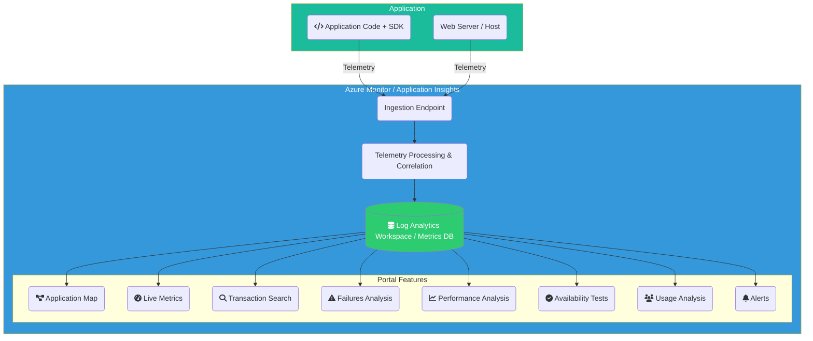

### **1.3.4 Azure Metrics**

Azure Metrics focus on time-series data representing performance and health of resources.

*   **Types:**
    *   **Platform Metrics:** Collected automatically for Azure resources (e.g., VM CPU %, Storage Account Transactions, App Service Requests). No agent needed.
    *   **Guest OS Metrics:** Performance counters from within the VM OS (e.g., Logical Disk IOPS, Memory Available MB). Requires Azure Monitor Agent (or legacy Diagnostics Extension). Sent to Azure Monitor Metrics database (recommended) or Log Analytics/Storage.
    *   **Application Insights Metrics:** Standard metrics collected by App Insights (e.g., Server response time, Request failure rate).
    *   **Custom Metrics:** Can be sent via Application Insights SDK, Custom Metrics API, or collected from VMs via agent.

*   **Features:**
    *   **Metrics Explorer:** Primary tool for plotting charts, visual correlation, applying dimensions (filters/splitting), changing aggregation (Avg, Sum, Min, Max, Count).
    *   **Multi-dimensional Metrics:** Allow filtering and segmenting metrics by property values (e.g., filter Storage Transactions by API Name or Status Code).

*   **Use Cases:** Performance troubleshooting, capacity planning, triggering Autoscaling rules, triggering Metric Alerts.

### **1.3.5 Alerting**

Azure Monitor Alerts proactively notify you or trigger automated actions when issues are found in your infrastructure or application data.

*   **Alert Rule Types:**
    *   **Metric Alert:** Triggers when a metric value crosses a defined threshold (Static or Dynamic Thresholds). Can monitor multiple resources with one rule (using dimensions).
    *   **Log Alert (Scheduled Query):** Runs a KQL query against Log Analytics data on a schedule. Triggers based on the query results (e.g., number of results > threshold, metric measurement from query results).
    *   **Activity Log Alert:** Triggers based on events in the Azure Activity Log (e.g., Service Health events, resource creation/deletion, policy assignment changes, RBAC changes).

*   **Components:**
    *   **Alert Rule:** Defines the target resource(s), condition logic, evaluation frequency, and severity.
    *   **Condition:** The specific criteria to evaluate (e.g., `Percentage CPU > 90% for 5 minutes`, `Heartbeat missing for 10 minutes`, `Service Health event occurred`).
    *   **Action Group:** A collection of notification preferences and/or automated actions. Can be reused across multiple alert rules.
        *   **Notifications:** Email, SMS, Azure App Push Notification, Voice Call.
        *   **Actions:** Trigger Automation Runbook, Azure Function, ITSM Tool (ServiceNow, etc.), Logic App, Secure Webhook, Webhook.
    *   **Alert State:** New, Acknowledged, Closed. Metric alerts are typically stateful (fire once when threshold crossed, auto-resolve when condition clears), while Log/Activity Log alerts can be stateful or stateless.

*   **Alert Processing Rules (Preview):** Allow suppression of notifications during planned maintenance windows by applying rules to specific scopes/timeframes/filters.

**Diagram 1.3.5.A: Azure Monitor Alerting Workflow**
```mermaid
graph TD
    DataSource(fa:fa-database Metrics / Logs / Activity Log) --> AlertRule{Alert Rule Defined};
    AlertRule -- Evaluates --> Condition{Condition Logic (e.g., CPU > 90%)};
    Condition -- Threshold Met --> AlertFired(fa:fa-bell Alert State: Fired);
    AlertFired --> ActionGroup{Action Group Triggered};

    subgraph ActionGroupDetails [Action Group]
        direction LR
        Notify(Notifications: Email, SMS, Push, Voice)
        Automate(Actions: Function, Logic App, Webhook, Runbook, ITSM)
    end

    ActionGroup --> Notify;
    ActionGroup --> Automate;

    Notify --> User(fa:fa-user User / Team Notified);
    Automate --> System(fa:fa-cogs Automated Remediation / Ticketing);

    Condition -- Threshold No Longer Met (Stateful) --> AlertResolved(fa:fa-check-circle Alert State: Resolved);

    style DataSource fill:#2ECC71,color:#FFF
    style AlertRule fill:#3498DB,color:#FFF
    style AlertFired fill:#E74C3C,color:#FFF
    style ActionGroup fill:#F39C12,color:#FFF
    style AlertResolved fill:#4CAF50,color:#FFF
```

### **1.3.6 Visualization & Reporting**

Visualizing monitoring data is key to understanding trends, identifying anomalies, and sharing insights.

*   **Azure Dashboards:** Customizable canvas in the Azure portal. Can pin charts from Metrics Explorer, Log Analytics query results, Application Insights visualizations, Service Health maps, static Markdown content. Good for creating NOC/SOC views or personal status dashboards. Relatively static once created.
*   **Azure Monitor Workbooks:** Provide a flexible canvas for creating rich, interactive visual reports. Combine text, metrics charts, log queries (rendered as tables, charts, grids), parameters. Support parameterization for reusable reports across different resources/scopes. Many built-in templates available (e.g., for performance analysis, usage analysis, cost optimization). More powerful and interactive than Dashboards.
*   **Power BI:** Robust business analytics service. Can connect directly to Log Analytics workspaces to build sophisticated reports and dashboards, combining monitoring data with other business data. Requires Power BI licensing/setup.
*   **Grafana:** Popular open-source analytics and visualization platform. Azure Monitor has a data source plugin for Grafana, allowing visualization of Azure Metrics and Logs within Grafana dashboards.

**Comparison Table 1.3.6.A: Azure Dashboards vs. Azure Monitor Workbooks**

| Feature             | Azure Dashboards                          | Azure Monitor Workbooks                     |
| :------------------ | :---------------------------------------- | :------------------------------------------ |
| **Primary Use**     | NOC/SOC views, Personal status overview   | Interactive reporting, Deep analysis        |
| **Interactivity**   | Low (Basic filtering on some tiles)       | High (Parameters, Tabs, Visualizations)     |
| **Content Types**   | Pinned charts/queries, Markdown, etc.     | Text, Metrics, Logs, Parameters, Links, etc.|
| **Complexity**      | Simple to create by pinning               | More complex, richer capabilities           |
| **Sharing**         | Role-based access control                 | Role-based access control                   |
| **Templating**      | Limited (ARM templates for dashboard)     | Strong (Built-in & Custom Templates)        |
| **Data Correlation**| Visual juxtaposition                      | Rich correlation within a single report     |

### **1.3.7 Azure Service Health**

Azure Service Health provides personalized alerts and guidance when Azure service issues, planned maintenance, or health advisories affect your resources.

*   **Components:**
    *   **Service Issues:** Problems in Azure services currently affecting your resources (outages, performance degradation). Provides updates, impact details, and workarounds if available.
    *   **Planned Maintenance:** Maintenance activities scheduled by Microsoft that might impact the availability of your resources. Provides scheduling details and impact assessment.
    *   **Health Advisories:** Issues requiring you to act to avoid service interruption (e.g., service retirements, breaking changes).
    *   **Resource Health:** Provides information about the health of your *individual* resource instances (e.g., is this specific VM available? Why was it rebooted?). Complements the broader Service Health view. Accessible from the resource blade or via Service Health.

*   **Alerting:** You can configure Activity Log alerts to be notified about Service Health events relevant to your subscriptions/regions/services.

**Diagram 1.3.7.A: Service Health vs. Resource Health Scope**
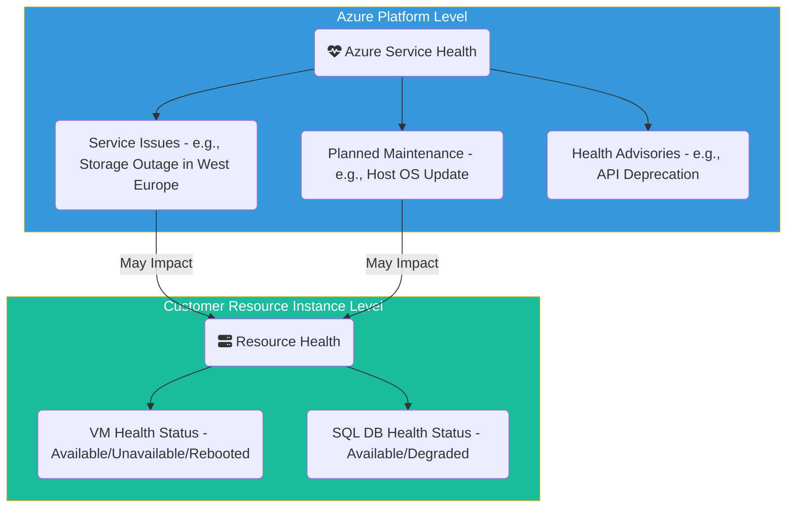

---
**(End of Section 1)**

Okay, let's proceed with Section 2: Design Data Storage Solutions, ensuring full detail and avoiding parentheses `(` and `)` in the Mermaid.js code.

---

**(Start of Section 2)**

# **Section 2: Design Data Storage Solutions**

Choosing the right data storage solution in Azure is fundamental to building performant, scalable, cost-effective, and reliable applications. Azure offers a wide array of storage services, each optimized for different data types, access patterns, consistency requirements, and performance needs. This section delves into designing solutions for non-relational data (like objects, files, NoSQL), relational data (SQL databases), and the integration services needed to move and transform data between them. Key considerations include data structure, latency, throughput, IOPS, consistency models, high availability, disaster recovery, security, and cost.

---

## **2.1 Design Non-Relational Data Storage**

Non-relational storage encompasses a broad category of data that doesn't fit neatly into traditional row-and-column database structures. This includes object storage for unstructured data, file shares, NoSQL databases (key-value, document, graph, column-family), and caching solutions.

### **2.1.1 Azure Storage Accounts**

The Azure Storage account is a foundational service providing a unique namespace in Azure for your data. It acts as a container for various storage services like Blobs, Files, Queues, Tables, and Disks (though Managed Disks are typically managed separately now).

*   **Account Types:**
    *   **Standard General-purpose v2:** Most common type, supports Blob (Block, Append, Page), File, Queue, Table storage. Supports all redundancy options and access tiers. Pay-as-you-go pricing.
    *   **Premium Block Blobs:** Optimized for high transaction rates and low-latency access using SSDs. Ideal for interactive workloads, big data analytics requiring fast access. Supports LRS and ZRS. Higher cost than Standard.
    *   **Premium FileShares:** Optimized for high-performance file shares using SSDs. Supports SMB and NFS protocols. Ideal for enterprise applications, HPC, databases requiring file shares. Supports LRS and ZRS. Higher cost.
    *   **Premium Page Blobs:** Optimized for high-performance random read/write operations (Page Blobs only). Primarily used as the underlying storage for Azure VM disks (though Managed Disks abstract this). Supports LRS only.

*   **Redundancy Options:** Determines how data is replicated for durability and availability.
    *   **Locally-redundant storage (LRS):** Three synchronous copies within a single physical location (datacenter rack) in the primary region. Lowest cost, protects against rack failure. Vulnerable to DC-level disaster.
    *   **Zone-redundant storage (ZRS):** Three synchronous copies across three different Availability Zones within the primary region. Protects against DC failure. Higher cost than LRS. Not available in all regions or for all account types/blob tiers.
    *   **Geo-redundant storage (GRS):** Copies data synchronously three times within the primary region (LRS) and then copies data asynchronously to a secondary region hundreds of miles away (three more copies via LRS in the secondary). Protects against regional disaster.
    *   **Read-access geo-redundant storage (RA-GRS):** Same as GRS, but provides read-only access to the data in the secondary region. Useful for DR read scenarios or geographic load balancing for reads. Higher cost than GRS.
    *   **Geo-zone-redundant storage (GZRS):** Copies data synchronously across three Availability Zones in the primary region (ZRS) and then copies data asynchronously to a secondary region (LRS). Combines ZRS protection with geo-replication.
    *   **Read-access geo-zone-redundant storage (RA-GZRS):** Same as GZRS, but provides read-only access to the data in the secondary region. Highest durability and availability option. Highest cost.

*   **Networking:**
    *   **Public Endpoints:** Accessible over the internet (default). Access secured via keys, SAS, RBAC, firewall.
    *   **Firewall and Virtual Networks:** Restrict access to specific public IP ranges or Azure Virtual Network subnets (using Service Endpoints or Private Endpoints).
    *   **Service Endpoints:** Provides secure and direct connectivity to storage from specified VNet subnets over the Azure backbone, using the storage account's public endpoint but routing traffic privately. The source IP seen by storage is the VNet private IP.
    *   **Private Endpoints:** Provisions a Network Interface (NIC) within your VNet with a private IP address that maps to the storage account service. All traffic stays within your VNet and the Azure backbone, disabling the public endpoint by default. Preferred method for maximum network isolation. Requires Private DNS Zone integration for name resolution.

*   **Security:**
    *   **Authentication:** Access Keys (Full account access - use cautiously), Shared Access Signatures (SAS - Delegated, granular, time-limited access), Microsoft Entra ID integration (for Blob and File RBAC), Anonymous access (for public Blobs).
    *   **Authorization:** Azure RBAC roles (e.g., Storage Blob Data Contributor, Storage File Data SMB Share Contributor) for Entra ID principals. Stored Access Policies (for defining SAS constraints server-side).
    *   **Encryption:** Storage Service Encryption (SSE) encrypts data at rest automatically (default). Uses Platform-Managed Keys (PMK) or Customer-Managed Keys (CMK) stored in Azure Key Vault. Customer-provided keys (SSE-C) option for Blobs. Infrastructure encryption (optional double encryption). Encryption in transit via HTTPS (default). SMB 3.0 encryption for Azure Files.

**Diagram 2.1.1.A: Storage Account Redundancy Options Visual**
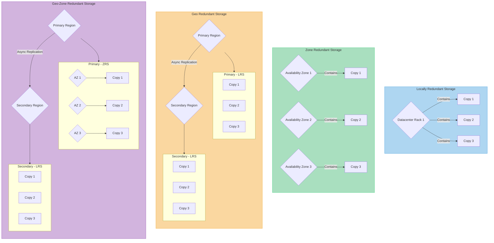

**Decision Tree 2.1.1.B: Choosing Storage Account Redundancy**
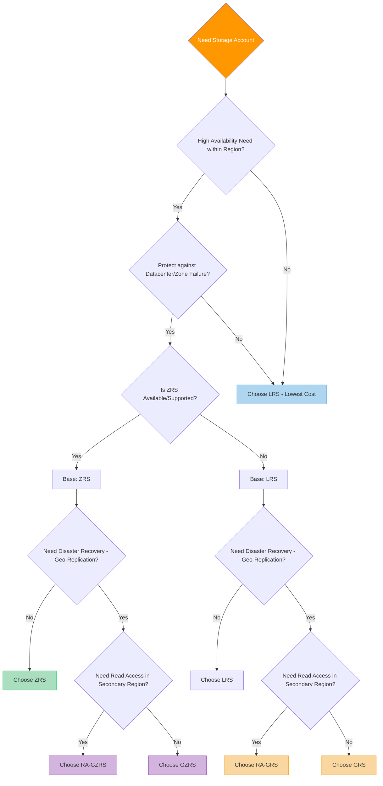

**Comparison Table 2.1.1.C: Access Keys vs. SAS vs. RBAC vs. Managed Identity for Storage AuthN/AuthZ**

| Method          | Authentication          | Authorization Scope | Granularity        | Credential Mgmt | Use Case                                      |
| :-------------- | :---------------------- | :------------------ | :----------------- | :-------------- | :-------------------------------------------- |
| **Access Keys** | Shared Key (Account)    | Full Account        | All Services/Data  | Required (Rotate!) | Service-to-service (legacy), Admin tools      |
| **SAS Token**   | Shared Key or User Del. | Account or Service  | Specific Permissions, Expiry, IP | Generated Token | Delegated access (client uploads), Temp access |
| **Azure RBAC**  | Microsoft Entra ID Token | Container/Blob/File | Predefined Roles   | Entra ID Users/Groups | User/Group/App access to data plane           |
| **Managed ID**  | Microsoft Entra ID Token | Container/Blob/File | Predefined Roles   | None (Azure Managed) | Azure Service-to-Service (VM/Func -> Storage) |

### **2.1.2 Azure Blob Storage**

Blob (Binary Large Object) storage is optimized for storing massive amounts of unstructured data, such as text or binary data.

*   **Blob Types:**
    *   **Block Blobs:** Composed of blocks (up to 100MB each, max size ~4.75TB or ~190.7 TiB for large blobs). Ideal for streaming, storing documents, images, videos, backups. Uploads can be parallelized.
    *   **Append Blobs:** Similar to block blobs but optimized for append operations. Ideal for logging scenarios where data is continuously added to the end of the blob. Max size same as Block Blobs.
    *   **Page Blobs:** Collection of 512-byte pages optimized for frequent random read/write operations. Max size 8TB. Used as the underlying storage for Azure IaaS disks (Managed Disks are recommended abstraction).

*   **Access Tiers:** Optimize cost based on access frequency. Applicable primarily to Block Blobs.
    *   **Hot:** Highest storage cost, lowest access cost. For frequently accessed data. Default tier.
    *   **Cool:** Lower storage cost, higher access cost (per-GB retrieval fee). For infrequently accessed data stored for at least 30 days.
    *   **Cold:** Even lower storage cost, higher access cost than Cool. For rarely accessed data stored for at least 90 days. New tier (preview in some regions).
    *   **Archive:** Lowest storage cost, highest access cost (retrieval fee + latency). For rarely accessed data stored for at least 180 days. Data is offline; retrieval (rehydration) can take hours.

*   **Lifecycle Management Policies:** Automate tiering and deletion. Rules based on blob age (last modified, created, last accessed), prefix match, index tags. Actions: TierToCool, TierToCold, TierToArchive, DeleteBlob, DeleteSnapshot.

*   **Features:**
    *   **Versioning:** Automatically maintains previous versions of a blob when overwritten or deleted. Protects against accidental modification/deletion.
    *   **Soft Delete:** Retains deleted blobs/versions for a configurable period, allowing recovery.
    *   **Immutability Policies (WORM - Write Once, Read Many):** Time-based or Legal Hold policies to make blob data non-erasable and non-modifiable for a specified interval. Used for compliance.
    *   **Change Feed:** Ordered log of changes (creation, modification, deletion) to blobs. Useful for processing data changes.
    *   **Static Website Hosting:** Serve static content (HTML, CSS, JS) directly from a special `$web` container.
    *   **Blob Index Tags:** Key-value tags applied to blobs, automatically indexed for faster filtering via `Find Blobs by Tags` API (used by Lifecycle Management, other apps).

**Diagram 2.1.2.A: Blob Access Tiers & Lifecycle Flow Visual**
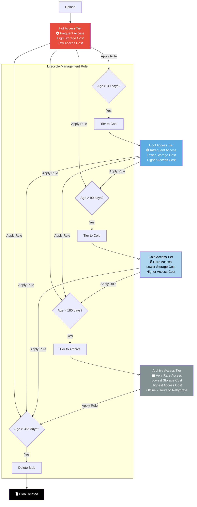

**Comparison Table 2.1.2.B: Blob Storage Tiers Comparison**

| Feature             | Hot Tier                 | Cool Tier                 | Cold Tier                 | Archive Tier              |
| :------------------ | :----------------------- | :------------------------ | :------------------------ | :------------------------ |
| **Intended Use**    | Frequently accessed data | Infrequently accessed data| Rarely accessed data      | Long-term archive, backup |
| **Min Duration**    | None                     | 30 days                   | 90 days                   | 180 days                  |
| **Availability SLA**| Highest                  | High (Slightly lower)     | High (Slightly lower)     | N/A (Offline)             |
| **Retrieval Latency**| Milliseconds             | Milliseconds              | Milliseconds              | Hours (Rehydration)       |
| **Storage Cost**    | Highest                  | Lower                     | Lower                     | Lowest                    |
| **Access/Txn Cost** | Lowest                   | Higher                    | Higher                    | Highest                   |
| **Retrieval Fee**   | No                       | Yes (Per GB)              | Yes (Per GB)              | Yes (Per GB)              |

### **2.1.3 Azure Files**

Azure Files offers fully managed file shares in the cloud, accessible via the standard Server Message Block (SMB) and Network File System (NFS) protocols.

*   **Protocols:**
    *   **SMB:** Versions 2.1, 3.0, 3.1.1. Standard for Windows file sharing, also supported by Linux/macOS.
    *   **NFS:** Version 4.1. Standard for Linux/UNIX file sharing. (Available on Premium tier FileStorage accounts only).

*   **Tiers:**
    *   **Premium (FileStorage Account Type):** Uses SSDs for high performance, low latency. Billed based on provisioned share size. Supports SMB and NFS.
    *   **Standard (General Purpose v2 Account Type):** Uses HDDs. Billed based on usage (storage used + transactions + snapshots). Supports SMB only. Within Standard, performance tiers exist: Transaction Optimized (default), Hot, Cool.

*   **Features:**
    *   **Snapshots:** Point-in-time, read-only copies of your file share. Useful for backups or recovering from accidental changes.
    *   **Soft Delete:** Protects shares from accidental deletion for a configurable period.
    *   **Azure File Sync:** Service to synchronize on-premises Windows Server file shares with Azure Files. Provides cloud tiering (cache hot files locally, tier cool files to Azure) and multi-site sync capabilities. Components: Storage Sync Service (Azure resource), Server Endpoint (Registered server path), Cloud Endpoint (Azure file share).

*   **Authentication & Authorization:**
    *   **Mounting:** Typically uses the Storage Account Key for direct mounting (less secure).
    *   **Identity-based Auth (SMB):**
        *   On-premises Active Directory Domain Services (AD DS) Integration: Join storage account to your AD DS domain. Users authenticate via Kerberos/NTLM. Requires line-of-sight to DCs.
        *   Microsoft Entra Kerberos (Preview): Authenticate hybrid identities synced to Entra ID using Kerberos. Simpler than AD DS integration for cloud/hybrid scenarios.
        *   Microsoft Entra Domain Services: Join storage account to managed AD DS domain in Azure.
    *   **Share-level permissions:** Assign RBAC roles (e.g., Storage File Data SMB Share Reader/Contributor/Elevated Contributor) for identity-based access.
    *   **NTFS ACLs:** Standard Windows ACLs are preserved and enforced for identity-based authentication. Can be configured via Windows File Explorer after mounting.
    *   **SAS Tokens:** Can be used for delegated access.

**Diagram 2.1.3.A: Azure File Sync Architecture Visual**
```mermaid
graph TD
    subgraph OnPremises [On-Premises / Other Cloud]
        WinServer[fa:fa-server Windows Server] --> SyncAgent{Azure File Sync Agent};
        LocalShare[/path/to/share] --> SyncAgent;
        SyncAgent -- Registers --> ServerEndpoint[Server Endpoint];
    end

    subgraph Azure
        direction LR
        StorageSyncSvc[fa:fa-cloud Storage Sync Service]
        CloudEndpoint[Cloud Endpoint] --> AzFileShare[fa:fa-folder Azure File Share];
        StorageSyncSvc -- Contains --> CloudEndpoint;
        StorageSyncSvc -- Manages Sync --> ServerEndpoint;
    end

    ServerEndpoint -- Syncs With --> CloudEndpoint;

    style OnPremises fill:#AED6F1, stroke:#3498DB
    style Azure fill:#A9DFBF, stroke:#2ECC71
    style StorageSyncSvc fill:#8E44AD,color:#FFF
    style AzFileShare fill:#F39C12,color:#FFF
```

**Comparison Table 2.1.3.B: Azure Files Tiers Comparison [Standard vs. Premium]**

| Feature         | Standard Tier [GPv2 Account] | Premium Tier [FileStorage Account] |
| :-------------- | :--------------------------- | :--------------------------------- |
| **Storage Media**| HDD                          | SSD                                |
| **Performance** | Moderate IOPS/Throughput     | High IOPS/Throughput, Low Latency  |
| **Protocols**   | SMB only                     | SMB & NFSv4.1                      |
| **Billing Model**| Pay-as-you-go [Usage + Txns] | Provisioned Capacity               |
| **Performance Tiers**| Transaction Optimized, Hot, Cool | N/A                              |
| **Use Case**    | General purpose file shares, Dev/Test, Backups | Enterprise apps, Databases, HPC, Container profiles |

### **2.1.4 Azure Table Storage**

Azure Table storage stores large amounts of structured NoSQL data. It's a key/attribute store with a schemaless design.

*   **Structure:**
    *   **Account:** The storage account.
    *   **Table:** A collection of entities.
    *   **Entity:** A set of properties, similar to a row. Max size 1MB.
    *   **Properties:** Key-value pairs. Up to 252 custom properties per entity + 3 system properties (PartitionKey, RowKey, Timestamp).
    *   **PartitionKey & RowKey:** Together form the unique primary key for an entity. PartitionKey determines entity locality for load balancing and scalability. RowKey is unique within a partition. Queries are fastest when targeting a specific PartitionKey and RowKey. Queries scanning multiple partitions are less efficient.

*   **Use Cases:** Storing user data for web apps, address books, device information, service metadata. Scenarios requiring massive scale for simple structured data where relationships are not complex and fast key-based lookup is needed. Often considered a lower-cost, simpler alternative to Cosmos DB Table API for less demanding workloads.
*   **Scalability Targets:** High scale limits per storage account.

### **2.1.5 Azure Queue Storage**

Azure Queue storage provides simple, reliable, persistent messaging for decoupling application components and building asynchronous workflows.

*   **Features:**
    *   **Queue:** Contains messages.
    *   **Message:** Up to 64KB in size (typically text, can be binary). Can persist for up to 7 days by default (configurable).
    *   **Simple API:** Add messages (Enqueue), Peek messages, Get messages (Dequeue - makes message invisible), Delete messages, Update messages.
    *   **Reliability:** At-least-once delivery guarantee. Messages become invisible during processing (Visibility Timeout); if not deleted within timeout, they reappear for another consumer.
    *   **Scalability:** High scale limits per storage account.

*   **Use Cases:** Decoupling web roles from worker roles, scheduling asynchronous tasks, passing messages between application components. Often compared to Azure Service Bus Queues, which offer more advanced features (larger messages, ordering, sessions, dead-lettering, transactions) but at a higher cost and complexity.

### **2.1.6 Azure Cosmos DB**

Azure Cosmos DB is a globally distributed, multi-model database service designed for high availability, low latency, and scalable throughput.

*   **APIs (Multi-Model):** Provides wire-protocol compatibility with several NoSQL database types:
    *   **Core (SQL) API:** Document database with SQL querying capabilities (most common).
    *   **MongoDB API:** Document database compatible with MongoDB drivers/tools.
    *   **Cassandra API:** Column-family database compatible with Cassandra Query Language (CQL).
    *   **Gremlin API:** Graph database compatible with Apache TinkerPop Gremlin query language.
    *   **Table API:** Key-value store compatible with Azure Table Storage API (provides premium features like global distribution, dedicated throughput, better indexing, lower latency).

*   **Key Concepts:**
    *   **Database:** A management unit for containers.
    *   **Container:** Where data (items, documents, nodes/edges, rows) is stored. Analagous to a table/collection. Throughput and storage are provisioned/billed at the container level (or shared across containers in a database).
    *   **Items:** Individual records within a container.
    *   **Request Units (RUs):** Abstract unit representing the cost (CPU, IOPS, memory) of database operations. Throughput is provisioned in RU/s.
    *   **Partitioning:** Data within a container is horizontally partitioned based on a **Partition Key** property chosen from your items. Critical for scalability and distributing throughput. Logical partitions (items with same key) are mapped to physical partitions (underlying infrastructure). Choose a high-cardinality partition key that evenly distributes requests.
    *   **Consistency Levels:** Trade-off between read consistency, availability, latency, and throughput.
        *   **Strong:** Linearizability. Reads guaranteed to return the most recent committed write globally. Highest consistency, lowest availability/performance.
        *   **Bounded Staleness:** Reads lag behind writes by a configurable amount (k versions or t interval). Guarantees read-your-own-writes within a session. Good balance.
        *   **Session:** Default level. Strong consistency within a client session (read-your-own-writes). Reads outside the session might lag. Most widely used.
        *   **Consistent Prefix:** Reads never see out-of-order writes.
        *   **Eventual:** Weakest consistency. Reads might see older data, no order guarantee. Highest availability/performance.

*   **Features:**
    *   **Global Distribution:** Replicate data across multiple Azure regions. Configure manual or automatic failover. Supports multi-region writes (multi-master). Provides low-latency access globally.
    *   **Throughput Provisioning:** Manual RU/s or Autoscale (scales RU/s based on usage within a configured range). Serverless option (pay per operation RU consumption).
    *   **Change Feed:** Ordered log of changes to items within a container. Used for event sourcing, data movement, downstream processing.
    *   **Indexing:** Automatic indexing of all properties by default (can be customized). Consistent regardless of consistency level.
    *   **Security:** RBAC for control plane, Keys or RBAC (via Entra ID) for data plane access, Private Endpoints, IP Firewall.
    *   **Backup:** Automatic periodic backups. Point-in-time restore option (additional cost).

**Diagram 2.1.6.A: Cosmos DB Global Distribution & Consistency Visual**
```mermaid
graph TD
    UserWest[User - West US]
    UserEast[User - East US]
    UserEurope[User - West Europe]

    subgraph CosmosDB [Azure Cosmos DB - Globally Distributed]
        direction LR
        RegionWest{Region: West US <br/> Write/Read Replica}
        RegionEast{Region: East US <br/> Read Replica}
        RegionEurope{Region: West Europe <br/> Read Replica}

        RegionWest -- Replication --> RegionEast;
        RegionWest -- Replication --> RegionEurope;
        RegionEast -- Replication --> RegionWest; %% Example for Multi-Master
        RegionEurope -- Replication --> RegionWest; %% Example for Multi-Master
    end

    UserWest -- Low Latency --> RegionWest;
    UserEast -- Low Latency --> RegionEast;
    UserEurope -- Low Latency --> RegionEurope;

    ConsistencyNote((Consistency Level Choice <br/> Impacts Read Latency & Data Staleness <br/> e.g., Strong vs Eventual));

    style CosmosDB fill:#0078D4,stroke:#FFF,stroke-width:2px,color:#FFF
    style RegionWest fill:#A9DFBF, stroke:#2ECC71
    style RegionEast fill:#AED6F1, stroke:#3498DB
    style RegionEurope fill:#FAD7A0, stroke:#F39C12
    style ConsistencyNote fill:#E74C3C, color:#FFF
```

**Diagram 2.1.6.B: Cosmos DB Partitioning Visual**
```mermaid
graph TD
    Container[Container: UserProfiles] --> LogicalPartitions{Logical Partitions [Grouped by Partition Key]};

    subgraph LogicalPartitions
        direction LR
        LP_City1[Partition Key: "Seattle"] --> Item1_1[Item: User A, City: Seattle];
        LP_City1 --> Item1_2[Item: User B, City: Seattle];
        LP_City2[Partition Key: "London"] --> Item2_1[Item: User C, City: London];
        LP_City3[Partition Key: "Tokyo"] --> Item3_1[Item: User D, City: Tokyo];
        LP_City3 --> Item3_2[Item: User E, City: Tokyo];
    end

    LogicalPartitions -- Mapped To --> PhysicalPartitions{Physical Partitions [Underlying Infrastructure]};

    subgraph PhysicalPartitions
        direction LR
        PP1[Physical Partition 1]
        PP2[Physical Partition 2]
        %% Mapping depends on hash of Partition Key
        LP_City1 --> PP1;
        LP_City2 --> PP2;
        LP_City3 --> PP1; %% Example mapping
    end

    Request[Query for User C where City='London'] --> LP_City2; %% Efficient - Targets single partition
    Request2[Query for all Users] --> PP1 & PP2; %% Inefficient - Cross-partition query

    style Container fill:#8E44AD,color:#FFF
    style LogicalPartitions fill:#3498DB,color:#FFF
    style PhysicalPartitions fill:#1ABC9C,color:#FFF
```

**Comparison Table 2.1.6.C: Cosmos DB Consistency Levels Comparison**

| Consistency Level  | Read Consistency Guarantee | Latency | Throughput | Availability | Use Case Example                               |
| :----------------- | :------------------------- | :------ | :--------- | :----------- | :--------------------------------------------- |
| **Strong**         | Linearizable (Latest Data) | Highest | Lowest     | Lowest       | Stock trading, Financial ledgers               |
| **Bounded Staleness**| Lag by K versions or T time| High    | Low        | High         | Real-time feeds needing near-latest data       |
| **Session**        | Read-Your-Own-Writes (in session) | Low     | High       | High         | User profiles, Shopping carts (Default)        |
| **Consistent Prefix**| Reads see ordered writes   | Low     | High       | High         | Scenarios needing order but tolerating some lag |
| **Eventual**       | No order guarantee         | Lowest  | Highest    | Highest      | Like counts, Non-critical counters, Recommendations |

**Decision Tree 2.1.6.D: Choosing a Cosmos DB API**
```mermaid
graph TD
    Start{Need NoSQL DB} --> Q_API{Existing Application or Data Model?};

    Q_API -- MongoDB App --> API_Mongo[Choose MongoDB API];
    Q_API -- Cassandra App --> API_Cassandra[Choose Cassandra API];
    Q_API -- Gremlin/Graph App --> API_Gremlin[Choose Gremlin API];
    Q_API -- Azure Table Storage App --> API_Table[Choose Table API];
    Q_API -- New App / Document Model --> API_SQL[Choose Core SQL API - Most Features];
    Q_API -- Key/Value Needs --> API_Table_Or_SQL[Consider Table API or Core SQL API];

    style Start fill:#FF9800,color:#FFF
    style API_Mongo fill:#4CAF50,color:#FFF
    style API_Cassandra fill:#4CAF50,color:#FFF
    style API_Gremlin fill:#4CAF50,color:#FFF
    style API_Table fill:#4CAF50,color:#FFF
    style API_SQL fill:#2196F3,color:#FFF
    style API_Table_Or_SQL fill:#2196F3,color:#FFF
```

### **2.1.7 Azure Data Lake Storage (ADLS) Gen2**

ADLS Gen2 combines the scale and cost-effectiveness of Azure Blob Storage with features optimized for big data analytics workloads. It's not a separate service type but rather a set of capabilities enabled on a Storage Account.

*   **Features:**
    *   **Built on Blob Storage:** Inherits Blob features like tiers, lifecycle management, HA/DR options, security features.
    *   **Hierarchical Namespace (HNS):** *Key differentiator.* Allows organizing objects into a hierarchy of directories and subdirectories, just like a file system. Enables atomic directory manipulation and improves performance for analytics jobs that rename/move directories. Enabled at the storage account level (requires new account creation).
    *   **POSIX-like Access Control Lists (ACLs):** Provides fine-grained file and directory level permissions (Read, Write, Execute) for specific users, groups, service principals, managed identities, in addition to RBAC. Essential for securing data lakes with multiple users/teams.
    *   **Optimized Driver (ABFS):** Azure Blob File System driver provides better performance for analytics frameworks like Azure Databricks, Azure Synapse Analytics, and HDInsight when interacting with HNS-enabled accounts.

*   **Use Cases:** Primary storage for data lakes used in big data processing (ETL/ELT), data warehousing (Synapse external tables), machine learning model training data, interactive analytics.

**Diagram 2.1.7.A: ADLS Gen2 vs. Blob Storage Structure Visual**
```mermaid
graph TD
    subgraph BlobStorage [Standard Blob Storage - Flat Namespace]
        direction LR
        ContainerBlob[Container: data]
        Blob1[blob1.csv]
        Blob2[folder/blob2.csv] %% 'folder/' is part of the blob name
        ContainerBlob --> Blob1 & Blob2;
    end

    subgraph ADLSGen2 [ADLS Gen2 - Hierarchical Namespace]
        direction LR
        ContainerADLS[Container: datalake]
        Folder1[fa:fa-folder folder]
        BlobADLS1[fa:fa-file blob1.csv]
        BlobADLS2[fa:fa-file blob2.csv]
        ContainerADLS --> Folder1;
        ContainerADLS --> BlobADLS1;
        Folder1 --> BlobADLS2; %% True directory structure
    end

    Note1["Blob: Directory operations like rename are slow - involves copying objects."]
    Note2["ADLS Gen2: Directory operations are fast, atomic metadata operations."]
    Note3["ADLS Gen2: Supports fine-grained ACLs on folders/files."]

    style BlobStorage fill:#AED6F1, stroke:#3498DB
    style ADLSGen2 fill:#A9DFBF, stroke:#2ECC71
```

### **2.1.8 Azure Cache for Redis**

Azure Cache for Redis provides an in-memory data store based on the popular open-source Redis software. It's used to improve application performance and scalability by caching frequently accessed data.

*   **Tiers:**
    *   **Basic:** Single node, no SLA. For dev/test, non-critical workloads.
    *   **Standard:** Two-node primary/replica configuration for High Availability (SLA).
    *   **Premium:** Adds features like Persistence (RDB/AOF backups to Storage), Clustering (sharding data across multiple nodes for higher throughput/memory), VNet deployment (injection), Geo-replication (linking caches across regions - active-passive).
    *   **Enterprise & Enterprise Flash:** Offered in partnership with Redis Labs. Adds capabilities like Redis Modules (RediSearch, RedisBloom, RedisTimeSeries), Active Geo-Replication (active-active), higher availability options. Enterprise Flash uses SSDs in addition to RAM for larger cache sizes at lower cost per GB than pure RAM.

*   **Use Cases:** Application data caching (database query results, API responses), Session state management for web applications, Message brokering (Redis Pub/Sub), Rate limiting, Distributed locking.

**Comparison Table 2.1.8.A: Azure Cache for Redis Tiers Comparison [Basic/Standard/Premium]**

| Feature         | Basic Tier        | Standard Tier     | Premium Tier                                  |
| :-------------- | :---------------- | :---------------- | :-------------------------------------------- |
| **Nodes**       | 1                 | 2 [Primary/Replica]| 2+ [Clustering possible]                      |
| **SLA**         | None              | Yes               | Yes                                           |
| **Persistence** | No                | No                | Yes [RDB/AOF to Azure Storage]                |
| **Clustering**  | No                | No                | Yes [Shard data across nodes]                 |
| **VNet Deploy** | No                | No                | Yes [Inject into VNet]                        |
| **Geo-Replication**| No             | No                | Yes [Link caches across regions]              |
| **Scaling**     | Cache Size        | Cache Size        | Cache Size, Throughput [via Clustering]       |
| **Use Case**    | Dev/Test          | Production Caching [HA] | High-performance, Large scale, VNet needs, DR |

### **2.1.9 Overall Non-Relational Storage Selection**

Choosing the right non-relational storage service depends heavily on the specific requirements of the workload.

**Decision Tree 2.1.9.A: Choosing Azure Non-Relational Storage**
```mermaid
graph TD
    Start{Need Non-Relational Storage} --> Q_DataType{Primary Data Type?};

    Q_DataType -- Unstructured Objects [Images, Videos, Backups] --> Blob[Consider Blob Storage - Check Tiers/Lifecycle];
    Q_DataType -- File Shares [SMB/NFS Access Needed] --> Files[Consider Azure Files - Check Tiers/Sync];
    Q_DataType -- Simple Key/Attribute Data [Massive Scale, Low Cost] --> Table[Consider Table Storage or CosmosDB Table API];
    Q_DataType -- Simple Message Queuing [Decoupling Tasks] --> Queue[Consider Queue Storage or Service Bus Queue];
    Q_DataType -- Document Data [JSON-like, Flexible Schema] --> CosmosDoc[Consider CosmosDB SQL API or MongoDB API];
    Q_DataType -- Column-Family Data [Wide Rows, High Write] --> CosmosCassandra[Consider CosmosDB Cassandra API];
    Q_DataType -- Graph Data [Nodes/Edges/Relationships] --> CosmosGremlin[Consider CosmosDB Gremlin API];
    Q_DataType -- Data Lake / Big Data Analytics --> ADLS[Use ADLS Gen2 - HNS Enabled Storage Account];
    Q_DataType -- In-Memory Caching [Low Latency Key/Value] --> Redis[Consider Azure Cache for Redis - Check Tiers];

    Blob --> End{Select Service & Configure};
    Files --> End;
    Table --> End;
    Queue --> End;
    CosmosDoc --> End;
    CosmosCassandra --> End;
    CosmosGremlin --> End;
    ADLS --> End;
    Redis --> End;

    style Start fill:#FF9800,color:#FFF
```

---

## **2.2 Design Relational Data Storage**

Relational databases store data in tables with predefined schemas, enforcing relationships and consistency. Azure offers several managed relational database services (PaaS) as well as the option to run databases on IaaS VMs.

### **2.2.1 Azure SQL Database**

Azure SQL Database is a fully managed Platform-as-a-Service (PaaS) database engine based on the latest stable Enterprise Edition of Microsoft SQL Server. It handles management operations like patching, backups, monitoring, and high availability.

*   **Deployment Options:**
    *   **Single Database:** A fully managed, isolated database. Resources are dedicated to this database. Suitable for most modern cloud applications.
    *   **Elastic Pool:** A collection of single databases that share a set pool of resources (eDTUs or vCores). Cost-effective for managing multiple databases with variable and unpredictable usage demands (SaaS apps, databases per tenant). Allows databases to automatically scale within pool limits.
    *   **Managed Instance (MI):** A fully managed SQL Server instance hosted in Azure, providing near 100% compatibility with on-premises SQL Server (including features like SQL Agent, Service Broker, CLR, DB Mail). Deployed within your VNet for network isolation. Ideal for migrating existing on-prem SQL Server applications with minimal changes.

*   **Purchasing Models:**
    *   **DTU (Database Transaction Unit):** Bundles compute, memory, and I/O resources into predefined performance levels (Basic, Standard, Premium). Simpler model, good for predictable workloads where resource ratios are balanced. Cannot use Reserved Capacity or AHB.
    *   **vCore (Virtual Core):** Allows independent scaling of compute (vCores) and storage. Provides greater transparency and control. Eligible for Azure Hybrid Benefit and Reserved Capacity/Savings Plans. Preferred model for most new deployments.

*   **Service Tiers (vCore Model):** Define performance, storage type, HA/DR capabilities.
    *   **General Purpose:** Balanced price-performance for most business workloads. Uses Premium SSD remote storage. Offers a Serverless compute option. HA based on separating compute and storage with failover replica.
    *   **Business Critical:** Highest performance and resilience for mission-critical applications with low latency I/O requirements. Uses local SSD storage. Includes multiple readable secondary replicas for HA and read scale-out. Highest cost.
    *   **Hyperscale:** Optimized for Very Large Databases (VLDBs - up to 100TB). Architecture separates compute, log service, and page servers for rapid scaling (compute/storage independently), fast backups/restores regardless of data size. Not all SQL features supported initially (evolving).

*   **Compute Tiers (vCore Model):**
    *   **Provisioned:** Dedicated compute resources allocated continuously. Predictable performance and cost.
    *   **Serverless (General Purpose Tier Only):** Compute automatically scales based on workload demand and pauses during inactivity (configurable delay). Billed per second for compute used. Ideal for intermittent, unpredictable workloads where paying for idle compute is undesirable.

*   **High Availability (HA) & Disaster Recovery (DR):**
    *   **HA:** Built-in automatically based on service tier (e.g., redundant replicas in Business Critical). Zone Redundancy option available for GP/BC/Hyperscale in supported regions.
    *   **DR:**
        *   **Geo-Replication (Active Geo-Replication):** Create readable secondary databases in different regions. Manual failover. Available for all tiers.
        *   **Failover Groups:** Builds on geo-replication by providing a single listener endpoint (read-write and optional read-only) that automatically redirects connections to the current primary database after failover. Simplifies application connection strings. Supports automatic or manual failover policies.

*   **Security:**
    *   **Network:** IP Firewall rules, Virtual Network rules (Service Endpoints), Private Endpoints.
    *   **Authentication:** SQL Authentication (username/password), Microsoft Entra ID Authentication (Integrated, Password, Service Principal, Managed Identity).
    *   **Authorization:** Database roles, Server roles (MI), Object-level permissions.
    *   **Data Protection:** Transparent Data Encryption (TDE - encrypts data at rest, default), Always Encrypted (client-side encryption protecting sensitive data even from DBAs), Dynamic Data Masking (obfuscates data for non-privileged users).
    *   **Auditing:** Track database events to logs (Storage, Log Analytics, Event Hubs).

**Comparison Table 2.2.1.A: SQL DB Single vs. Elastic Pool vs. Managed Instance Comparison**

| Feature             | Single Database                     | Elastic Pool                        | Managed Instance (MI)                 |
| :------------------ | :---------------------------------- | :---------------------------------- | :------------------------------------ |
| **Resource Model**  | Dedicated resources per DB          | Shared resources across DBs         | Dedicated SQL Server Instance         |
| **Management**      | Fully Managed DB                    | Fully Managed Pool + DBs            | Fully Managed Instance                |
| **Compatibility**   | High (Latest SQL Engine Features)   | High (Latest SQL Engine Features)   | Very High (Near 100% SQL Server)      |
| **VNet Integration**| Optional (Service/Private Endpoint) | Optional (Service/Private Endpoint) | Required (Deployed inside VNet)       |
| **Key Features**    | Serverless option, Hyperscale tier  | Cost efficiency for many DBs        | SQL Agent, CLR, Service Broker, DB Mail |
| **Use Case**        | New cloud apps, Most workloads      | SaaS apps, Multi-tenant DBs         | Lift-and-shift on-prem SQL Server     |
| **Cost Model**      | Per DB (DTU or vCore)               | Per Pool (eDTU or vCore)            | Per Instance (vCore only)             |

**Comparison Table 2.2.1.B: SQL DB Service Tiers Comparison [GP vs. BC vs. Hyperscale - vCore]**

| Feature             | General Purpose                     | Business Critical                   | Hyperscale                          |
| :------------------ | :---------------------------------- | :---------------------------------- | :---------------------------------- |
| **Performance**     | Good (Balanced)                     | Highest (Low Latency)               | High (Optimized for VLDBs)          |
| **Storage Type**    | Remote Premium SSD                  | Local SSD                           | Decoupled Page Servers              |
| **IO Latency**      | Higher (5-10ms)                     | Lowest (1-2ms)                      | Low (Depends on cache)              |
| **HA Architecture** | Remote Storage + Compute Replica    | Multiple Replicas (Always On AG)    | Redundant Page Servers/Log Service  |
| **Readable Secondary**| No                                  | Yes (1 included)                    | Yes (Named Replicas optional)       |
| **Max DB Size**     | ~4TB (Depends on compute)           | ~4TB (Depends on compute)           | 100TB                               |
| **Backup/Restore**  | Size-of-data dependent              | Size-of-data dependent              | Fast (Snapshot-based, constant time)|
| **Serverless Option**| Yes                                 | No                                  | No (Preview possible)               |
| **Use Case**        | Most business apps, Dev/Test        | Mission-critical, Low-latency apps  | Very Large Databases (VLDBs)        |
| **Cost**            | Moderate                            | Highest                             | High (Optimized for large scale)    |

**Diagram 2.2.1.C: Azure SQL DB Failover Group Architecture Visual**
```mermaid
graph TD
    App[fa:fa-laptop Application] --> ListenerRW{Read-Write Listener Endpoint};
    App --> ListenerRO{Read-Only Listener Endpoint [Optional]};

    subgraph PrimaryRegion [Primary Region - West US]
        ListenerRW -- Points To --> PrimaryDB[(fa:fa-database Primary SQL DB)];
        ListenerRO -- Points To --> SecondaryReadable1[(fa:fa-database Readable Secondary 1)]; %% Only if BC/HS or Active Geo-Rep
    end

    subgraph SecondaryRegion [Secondary Region - East US]
        SecondaryDB[(fa:fa-database Secondary SQL DB)];
        ListenerRO -- Can Point To --> SecondaryDB; %% If configured
    end

    PrimaryDB -- Geo-Replication --> SecondaryDB;

    Failover[Initiate Failover <br/> fa:fa-exchange-alt] -- Updates Listener --> ListenerRW;
    Failover -- Promotes --> SecondaryDB;
    Failover -- Demotes --> PrimaryDB;

    %% After Failover
    %% ListenerRW now points to SecondaryDB in East US

    style PrimaryRegion fill:#A9DFBF, stroke:#2ECC71
    style SecondaryRegion fill:#AED6F1, stroke:#3498DB
    style ListenerRW fill:#F39C12,color:#FFF
    style ListenerRO fill:#F39C12,color:#FFF
    style Failover fill:#E74C3C,color:#FFF
```

### **2.2.2 Azure Database for PostgreSQL / MySQL / MariaDB**

These services offer fully managed open-source database engines (PostgreSQL, MySQL, MariaDB) as a PaaS offering.

*   **Deployment Options:**
    *   **Single Server:** Original offering. Less flexible networking and configuration. Being phased out for new deployments in favor of Flexible Server.
    *   **Flexible Server:** Newer architecture offering better price-performance, more control over configuration, VNet integration (via VNet injection), custom maintenance windows, Burstable compute SKUs, and built-in High Availability options. Preferred deployment model.
    *   **Hyperscale (Citus) - PostgreSQL Only:** Provides horizontal scaling (sharding) for PostgreSQL using the Citus extension. For distributed query processing across multiple nodes.

*   **High Availability (Flexible Server):**
    *   **Same-Zone HA:** Provisions a standby replica within the same Availability Zone. Synchronous replication. Automatic failover.
    *   **Zone-Redundant HA:** Provisions a standby replica in a different Availability Zone within the same region. Synchronous replication. Automatic failover. Provides higher availability against zone failures.

*   **Read Replicas:** Create up to 5 read-only replicas (asynchronous replication) within the same region or across regions to scale out read workloads or for DR purposes. Manual promotion required for DR failover.
*   **Security:** Firewall rules, Private Link support, VNet integration (Flexible Server), SSL enforcement, Microsoft Entra ID authentication support (PostgreSQL/MySQL).

**Comparison Table 2.2.2.A: Flexible Server vs. Single Server Comparison [OSS DBs]**

| Feature             | Flexible Server                     | Single Server [Legacy]              |
| :------------------ | :---------------------------------- | :---------------------------------- |
| **Architecture**    | Newer (Container-based)             | Older                               |
| **VNet Integration**| Yes (VNet Injection)                | Limited (Service Endpoints)         |
| **High Availability**| Yes (Same-Zone / Zone-Redundant)    | Limited (Read Replicas only)        |
| **Compute SKUs**    | General Purpose, Memory Optimized, Burstable | General Purpose, Memory Optimized |
| **Maintenance**     | Custom Maintenance Windows          | Service Managed Window              |
| **Stop/Start**      | Yes                                 | No                                  |
| **Cost**            | Often better Price/Performance      | Can be higher for equivalent perf.  |
| **Recommendation**  | Preferred for new deployments       | Avoid for new deployments           |

### **2.2.3 SQL Server on Azure Virtual Machines (IaaS)**

Running SQL Server on an Azure VM provides maximum control and compatibility, essentially lifting and shifting an on-premises SQL Server environment to Azure infrastructure.

*   **Use Cases:**
    *   Full control over OS and SQL Server instance configuration needed.
    *   Specific SQL Server versions or features required that are not available in PaaS offerings (e.g., older versions, Filestream, PolyBase on older versions).
    *   Lift-and-shift migrations with minimal changes.
    *   Dependencies on OS-level features or third-party software running alongside SQL Server.
    *   Consolidating SQL Server and application components on the same VM (less common).

*   **Management:** Customer is responsible for:
    *   OS and SQL Server patching and updates.
    *   High Availability configuration (e.g., Windows Server Failover Clustering - WSFC, Always On Availability Groups - AGs, Failover Cluster Instances - FCIs).
    *   Disaster Recovery setup (e.g., Log Shipping, AGs across regions).
    *   Backup configuration (SQL native backups, Azure Backup for SQL Server in VM).
    *   Performance tuning and monitoring.

*   **SQL IaaS Agent Extension:** Optional extension providing integration with Azure portal for manageability benefits like automated backups, automated patching, simplified licensing (AHB), Key Vault integration for TDE, monitoring metrics. Recommended for all SQL VMs.
*   **Storage Configuration:** Use Premium SSD Managed Disks (P30 or higher recommended for performance). Configure multiple disks and use Storage Spaces (Windows) or LVM/mdadm (Linux) for optimal IOPS/throughput. Separate disks for Data, Logs, TempDB. Enable Read caching on data disks, None on log disks.

**Comparison Table 2.2.3.A: Azure SQL DB/MI vs. SQL Server on Azure VM Comparison**

| Feature             | Azure SQL DB / Managed Instance [PaaS] | SQL Server on Azure VM [IaaS]         |
| :------------------ | :------------------------------------- | :------------------------------------ |
| **Management**      | Azure Managed (Patching, Backups, HA)  | Customer Managed                      |
| **Control**         | Limited (DB/Instance Level)            | Full (OS & SQL Instance Level)        |
| **Compatibility**   | High (MI very high)                    | 100% (Any supported SQL version)      |
| **HA/DR**           | Built-in / Easy Configuration          | Manual Configuration (AGs, FCI, etc.) |
| **Feature Set**     | Latest stable features (some limitations in MI vs latest SQL) | All SQL Server features available     |
| **Licensing**       | Included (vCore) or AHB eligible       | BYOL (AHB) or Pay-as-you-go           |
| **Cost**            | Can be lower TCO due to reduced ops    | Infrastructure + License + Ops Costs  |
| **Initial Setup**   | Faster Provisioning                    | Slower (OS + SQL Install/Config)      |
| **Use Case**        | New Apps, Modernization, Reduced Ops   | Lift-and-Shift, Max Control, Specific Features |

### **2.2.4 Overall Relational Storage Selection**

Choosing the right relational database service involves balancing compatibility, management overhead, features, performance, and cost.

**Decision Tree 2.2.4.A: Choosing Azure Relational Storage**
```mermaid
graph TD
    Start{Need Relational DB} --> Q_Engine{DB Engine Required?};

    Q_Engine -- SQL Server --> Q_Compatibility{Need High On-Prem SQL Server Compatibility? [e.g., SQL Agent, CLR]};
    Q_Engine -- PostgreSQL --> PG_Flex[Choose Azure DB for PostgreSQL - Flexible Server];
    Q_Engine -- MySQL --> MySQL_Flex[Choose Azure DB for MySQL - Flexible Server];
    Q_Engine -- MariaDB --> MariaDB_Flex[Choose Azure DB for MariaDB - Flexible Server];

    Q_Compatibility -- Yes --> MI[Choose Azure SQL Managed Instance];
    Q_Compatibility -- No --> Q_Control{Prefer PaaS [Managed Service] or IaaS [Full Control]?};

    Q_Control -- PaaS --> Q_MultiDB{Need Cost Optimization for Many Variable DBs?};
    Q_Control -- IaaS --> SQLVM[Choose SQL Server on Azure VM];

    Q_MultiDB -- Yes --> ElasticPool[Choose Azure SQL DB - Elastic Pool];
    Q_MultiDB -- No --> SingleDB[Choose Azure SQL DB - Single Database];

    PG_Flex --> End{Select Service & Configure Tier};
    MySQL_Flex --> End;
    MariaDB_Flex --> End;
    MI --> End;
    SQLVM --> End;
    ElasticPool --> End;
    SingleDB --> End;

    style Start fill:#FF9800,color:#FFF
    style MI fill:#2ECC71,color:#FFF
    style SQLVM fill:#AED6F1,color:#000
    style ElasticPool fill:#A9DFBF,color:#FFF
    style SingleDB fill:#A9DFBF,color:#FFF
    style PG_Flex fill:#A9DFBF,color:#FFF
    style MySQL_Flex fill:#A9DFBF,color:#FFF
    style MariaDB_Flex fill:#A9DFBF,color:#FFF
```

---

## **2.3 Design Data Integration**

Data integration involves moving and transforming data between various storage systems, often as part of Extract, Transform, Load (ETL) or Extract, Load, Transform (ELT) processes. Azure provides several services tailored for different data integration scenarios.

### **2.3.1 Azure Data Factory (ADF)**

ADF is Azure's cloud-based, serverless ETL and data integration service for orchestrating and automating data movement and transformation at scale.

*   **Core Components:**
    *   **Pipeline:** A logical grouping of activities that perform a unit of work (e.g., copy data, transform data).
    *   **Activity:** Represents a processing step in a pipeline. Types include Data Movement (Copy Activity), Data Transformation (Mapping Data Flow, Wrangling Data Flow, Databricks, Stored Proc, U-SQL), and Control Flow (Execute Pipeline, ForEach, If Condition, Wait, Webhook).
    *   **Dataset:** Represents the data structure within a data store (e.g., a specific SQL table, a folder in Blob storage). Points to a Linked Service.
    *   **Linked Service:** Connection string information needed to connect to external resources (data stores or compute environments).
    *   **Trigger:** Defines when a pipeline execution should start (Schedule, Tumbling Window - time slices, Storage Event, Custom Event).
    *   **Integration Runtime (IR):** The compute infrastructure used by ADF to provide data movement, activity dispatch, and SSIS package execution capabilities across different network environments.
        *   **Azure IR:** Default serverless compute in Azure for cloud-to-cloud data movement and data flow execution. Region-specific.
        *   **Self-Hosted IR:** Software installed on on-premises machines or VMs in other clouds/VNets to enable data movement/activity dispatch involving private networks. Acts as a secure gateway.
        *   **Azure-SSIS IR:** Dedicated Azure compute for natively executing SQL Server Integration Services (SSIS) packages lifted-and-shifted to the cloud.

*   **Data Flows:** Provide code-free data transformation capabilities at scale.
    *   **Mapping Data Flows:** Visually design transformations (joins, aggregates, pivots, lookups, etc.) that execute on a scaled-out Azure Databricks Spark cluster managed by ADF. Suitable for complex transformations on large datasets (ELT/ETL).
    *   **Wrangling Data Flows (Power Query):** Use the Power Query Online mashup editor (familiar from Power BI/Excel) to perform data preparation and wrangling. Translates M code into Spark code for execution. Good for code-free data exploration and prep.

*   **Use Cases:** Cloud ETL/ELT, Data migration from on-prem/other clouds, Data warehousing data loading, Orchestrating big data workflows involving Databricks/Synapse/HDInsight.

**Diagram 2.3.1.A: Azure Data Factory Pipeline Flow with Integration Runtime Visual**
```mermaid
graph TD
    Trigger[fa:fa-clock Trigger <br/> Schedule / Event] --> Pipeline[fa:fa-project-diagram ADF Pipeline];

    subgraph Pipeline Activities
        direction LR
        CopyActivity[Copy Data Activity]
        DataFlowActivity[Mapping Data Flow Activity]
        ControlActivity[Control Flow Activity <br/> e.g., ForEach]
    end

    Pipeline --> CopyActivity & DataFlowActivity & ControlActivity;

    subgraph Connections
        LinkedService_Source[Linked Service - Source <br/> e.g., OnPrem SQL]
        LinkedService_Sink[Linked Service - Sink <br/> e.g., Azure Blob]
        LinkedService_Compute[Linked Service - Compute <br/> e.g., Databricks]
        Dataset_Source[Dataset - Source Table]
        Dataset_Sink[Dataset - Sink Folder]
    end

    CopyActivity -- Uses --> LinkedService_Source & Dataset_Source;
    CopyActivity -- Uses --> LinkedService_Sink & Dataset_Sink;
    DataFlowActivity -- Uses --> LinkedService_Compute; %% For Spark Cluster

    subgraph IntegrationRuntimes [Integration Runtimes]
        AzureIR[Azure IR <br/> Cloud Sources / Data Flow]
        SelfHostedIR[Self-Hosted IR <br/> On-Prem / Private VNet Sources]
    end

    LinkedService_Source -- Requires --> SelfHostedIR;
    LinkedService_Sink -- Uses --> AzureIR;
    DataFlowActivity -- Executes On --> AzureIR; %% Managed Spark

    style Trigger fill:#F39C12,color:#FFF
    style Pipeline fill:#8E44AD,color:#FFF
    style Connections fill:#3498DB,color:#FFF
    style IntegrationRuntimes fill:#1ABC9C,color:#FFF
```

### **2.3.2 Azure Synapse Analytics**

Azure Synapse is an integrated analytics service that brings together enterprise data warehousing and Big Data analytics. It provides a unified experience for ingesting, preparing, managing, and serving data for immediate BI and machine learning needs.

*   **Workspace Components:**
    *   **Synapse Studio:** Unified web UI for development, management, monitoring.
    *   **SQL Pools:**
        *   **Dedicated SQL Pool (formerly SQL DW):** Enterprise data warehousing using Massively Parallel Processing (MPP) architecture. Stores data in relational tables with columnar storage. Scales compute independently from storage (Data Warehouse Units - DWUs). Best for structured data warehousing, high-performance BI queries.
        *   **Serverless SQL Pool:** Query engine for data in the data lake (ADLS Gen2, Cosmos DB) using familiar T-SQL syntax. Pay-per-query (data processed). No infrastructure to manage. Ideal for data exploration, logical data warehouse over data lake.
    *   **Apache Spark Pools:** Managed Spark clusters for big data processing, data engineering, machine learning using notebooks (Python, Scala, SQL, .NET). Autoscaling, auto-pausing.
    *   **Data Explorer Pools (Preview):** Optimized engine for log and telemetry analytics using KQL.
    *   **Synapse Pipelines:** Embeds the capabilities of Azure Data Factory within the Synapse workspace for code-free data integration and orchestration.
    *   **Integration with Power BI, Azure ML.**

*   **Use Cases:** Modern data warehousing, unifying batch/streaming/interactive analytics, building logical data warehouses over data lakes, BI reporting, machine learning on large datasets.

**Diagram 2.3.2.A: Azure Synapse Analytics Workspace Architecture Visual**
```mermaid
graph TD
    subgraph SynapseWorkspace [Azure Synapse Workspace]
        SynapseStudio[fa:fa-desktop Synapse Studio UI]

        subgraph DataStorage [Integrated Storage]
            ADLS[fa:fa-database ADLS Gen2 - Data Lake]
        end

        subgraph ComputeEngines [Analytics Runtimes]
            DedicatedSQL[Dedicated SQL Pool - MPP DW]
            ServerlessSQL[Serverless SQL Pool - Query Lake]
            SparkPool[Apache Spark Pool - Big Data / ML]
            DataExplorerPool[Data Explorer Pool - Logs / Telemetry]
        end

        subgraph DataIntegration [Data Integration]
            Pipelines[Synapse Pipelines - ADF Engine]
        end

        SynapseStudio -- Manages / Develops --> DedicatedSQL & ServerlessSQL & SparkPool & DataExplorerPool & Pipelines;
        Pipelines -- Ingests / Moves Data --> ADLS & DedicatedSQL;
        ServerlessSQL -- Queries --> ADLS;
        SparkPool -- Processes / Queries --> ADLS;
        DedicatedSQL -- Stores / Queries --> DedicatedSQL; %% Internal Storage
        DataExplorerPool -- Ingests / Queries --> DataExplorerPool; %% Internal Storage

        ADLS -- Data Source For --> ServerlessSQL & SparkPool & DedicatedSQL [via PolyBase/COPY];
    end

    ExternalTools[BI Tools - Power BI / ML Tools - Azure ML] --> DedicatedSQL & ServerlessSQL & SparkPool;

    style SynapseWorkspace fill:#0078D4,stroke:#FFF,stroke-width:2px,color:#FFF
    style ComputeEngines fill:#A9DFBF, stroke:#2ECC71
    style DataIntegration fill:#AED6F1, stroke:#3498DB
    style DataStorage fill:#FAD7A0, stroke:#F39C12
    style ExternalTools fill:#9B59B6,color:#FFF
```

**Comparison Table 2.3.2.B: Synapse Dedicated SQL Pool vs. Serverless SQL Pool Comparison**

| Feature         | Dedicated SQL Pool [MPP DW]     | Serverless SQL Pool             |
| :-------------- | :------------------------------ | :------------------------------ |
| **Architecture**| MPP [Control Node + Compute Nodes]| Distributed Query Engine        |
| **Data Storage**| Managed Relational Tables       | External [ADLS Gen2, Cosmos DB] |
| **Compute**     | Provisioned [DWUs], Scalable    | Serverless, Auto-scales         |
| **Cost Model**  | Per Hour [DWU Provisioned] + Storage | Per Query [TB Data Processed]   |
| **Primary Use** | Enterprise Data Warehousing, BI | Data Lake Exploration, Logical DW |
| **Data Loading**| Required [COPY, PolyBase, ADF]  | Query data in place             |
| **Management**  | Higher [Stats, Indexing]        | Lower                           |

### **2.3.3 Azure Databricks**

Azure Databricks is a first-party Azure service offering an optimized Apache Spark-based analytics platform. It's designed for collaboration between data scientists, data engineers, and business analysts.

*   **Platform Features:**
    *   **Collaborative Notebooks:** Support multiple languages (Python, Scala, SQL, R) for interactive data analysis and visualization.
    *   **Managed Spark Clusters:** Easy creation, configuration, and autoscaling of Spark clusters. Optimized Databricks Runtime includes performance enhancements and common libraries.
    *   **Delta Lake:** Open-source storage layer bringing ACID transactions, scalable metadata handling, time travel (data versioning), schema enforcement/evolution to data lakes (typically ADLS Gen2). Default storage format in Databricks.
    *   **MLflow Integration:** Managed service for the machine learning lifecycle (tracking experiments, packaging code, deploying models).
    *   **Job Scheduling:** Schedule notebooks or JARs to run as automated jobs.
    *   **Workspace:** Collaborative environment for managing notebooks, clusters, jobs, libraries, models.
    *   **Security:** VNet injection for network isolation, Entra ID integration, Secrets management (integration with Key Vault via Databricks secrets scopes), Cluster policies, Table ACLs (on Unity Catalog).

*   **Use Cases:** Large-scale data processing (ETL/ELT) using Spark, Interactive data exploration and visualization, Machine learning model training and deployment, Streaming analytics (Spark Structured Streaming). Often used alongside ADF (ADF orchestrates Databricks notebooks) or Synapse.

**Comparison Table 2.3.3.A: ADF vs. Synapse Pipelines vs. Databricks for ETL/ELT Comparison**

| Feature             | Azure Data Factory [ADF]        | Synapse Pipelines                 | Azure Databricks                    |
| :------------------ | :------------------------------ | :-------------------------------- | :---------------------------------- |
| **Primary Focus**   | Orchestration, Data Movement    | Orchestration within Synapse      | Spark-based Processing, ML, Analytics |
| **Transformation**  | Mapping Data Flows [Visual Spark], Wrangling Data Flows [Power Query], Code Activities | Mapping Data Flows, Wrangling Data Flows, Code Activities | Spark Code [Python, Scala, SQL, R] in Notebooks/JARs |
| **Compute Engine**  | Managed Serverless Spark [Data Flows], Azure/Self-Hosted IR [Copy/Control] | Managed Serverless Spark [Data Flows], SQL/Spark Pools [Code] | Managed Spark Clusters              |
| **User Interface**  | Visual Drag-and-Drop            | Visual Drag-and-Drop [Synapse Studio] | Notebook-based, Code-centric        |
| **Skillset**        | Low-code / Pro-code             | Low-code / Pro-code               | Code-heavy [Spark, Python, Scala]   |
| **Cost Model**      | Per Activity Run, DIU Hours [Data Flows], IR Hours | Per Activity Run, DIU Hours, Pool Usage | Per Cluster Uptime [DBUs]           |
| **Integration**     | Broad connectors, Standalone    | Integrated within Synapse Workspace | Strong Spark ecosystem, Azure integration |
| **Best For**        | Orchestrating diverse tasks, Code-free complex transforms | Unified analytics platform tasks    | Complex code-based transforms, ML, Spark experts |

### **2.3.4 Event Ingestion Services Recap**

While primarily messaging/eventing services, these are often the starting point for data integration pipelines, feeding data into storage or processing systems.
*   **Event Hubs:** High-throughput ingestion for telemetry, application logs, streaming data. Data often landed in ADLS Gen2 via Event Hubs Capture or processed by Stream Analytics/Spark/Functions before landing.
*   **IoT Hub:** Similar to Event Hubs but adds device management, security, and bi-directional communication capabilities for IoT scenarios.
*   **Service Bus:** Used less for raw ingestion, more for reliable enterprise messaging between applications, which might then trigger data processing.
*   **Event Grid:** Routes discrete events (e.g., Blob Created event) which can trigger ADF pipelines or Functions to process the newly arrived data.

---
**(End of Section 2)**
