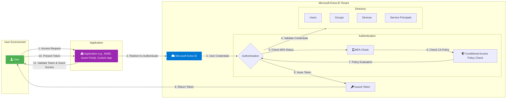
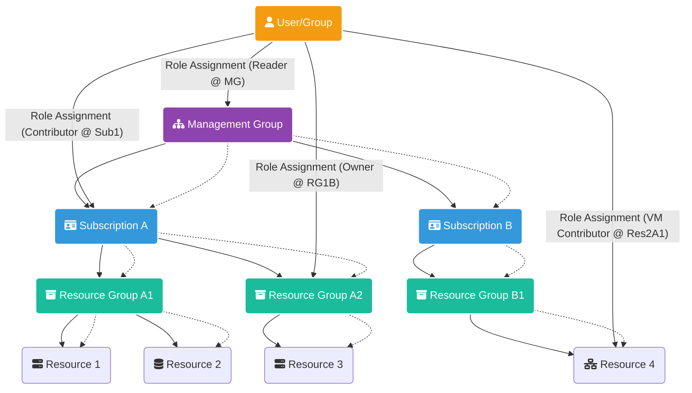
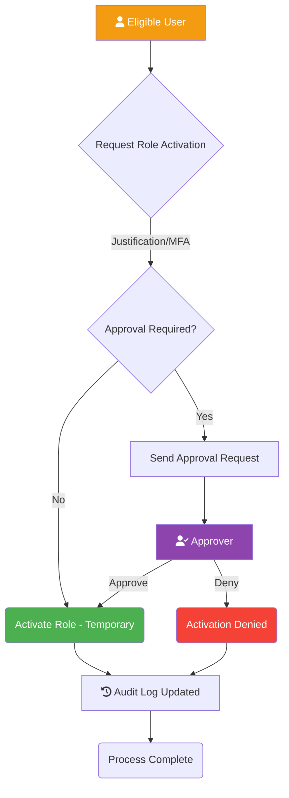
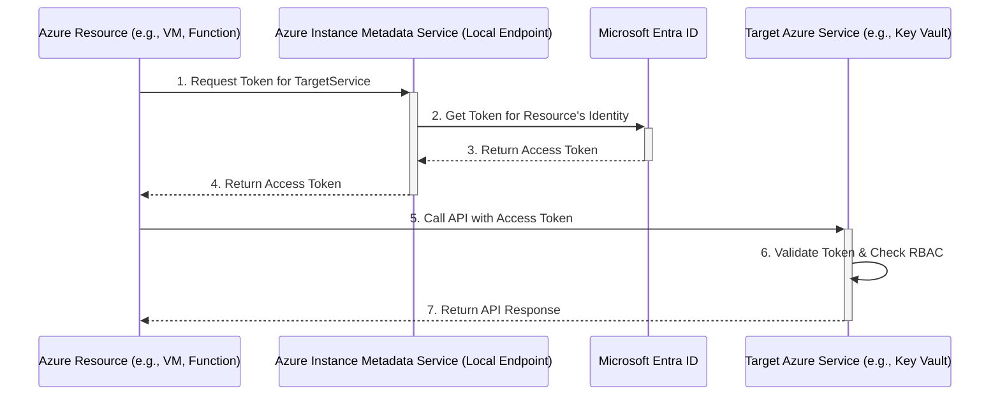
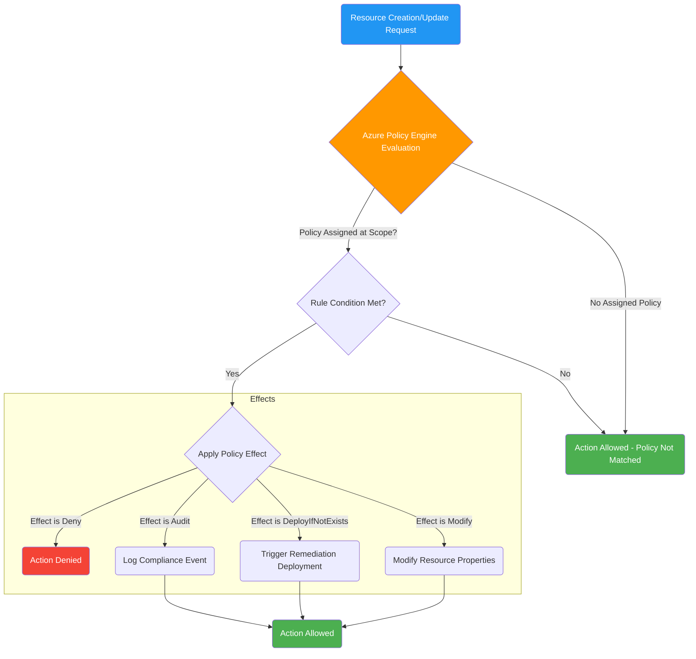
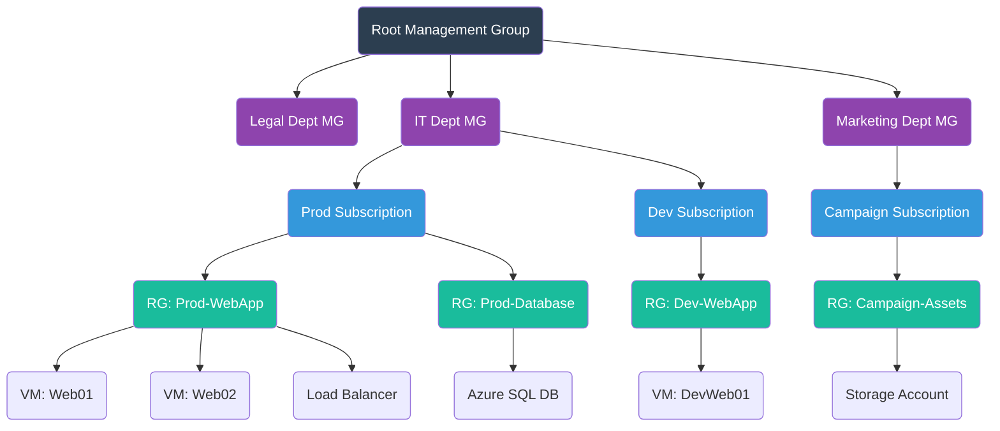
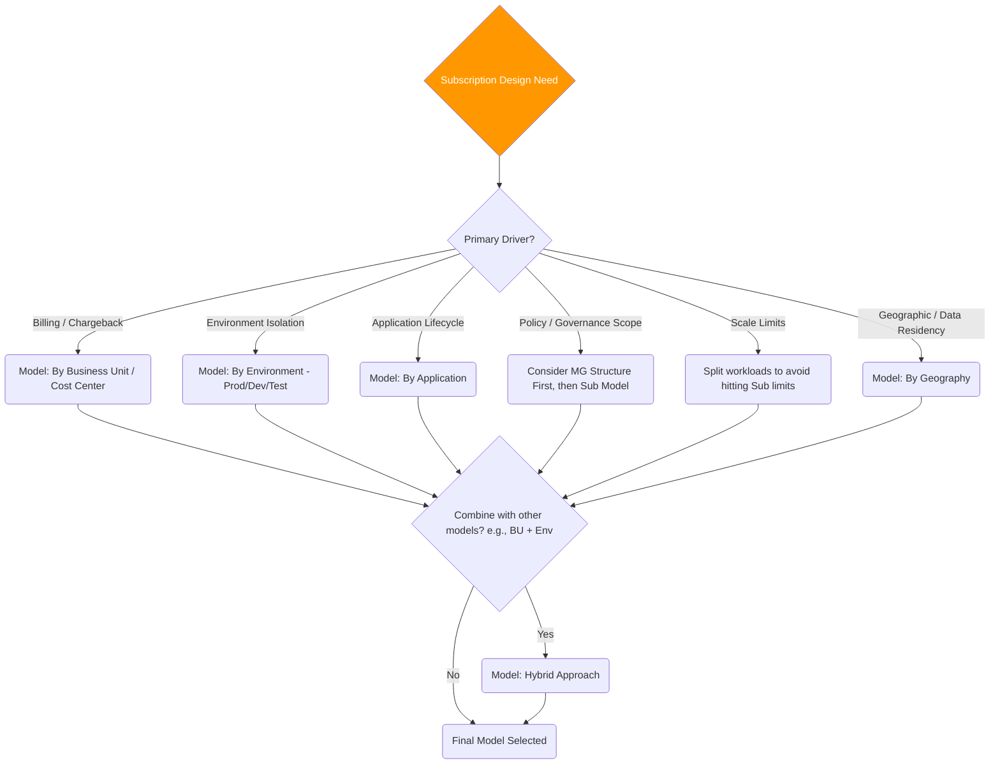
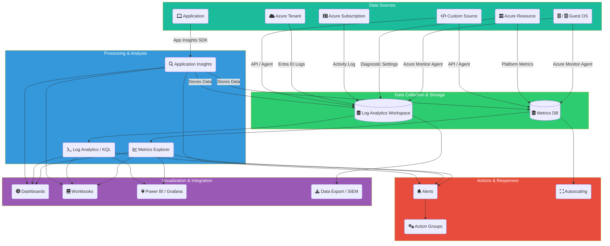
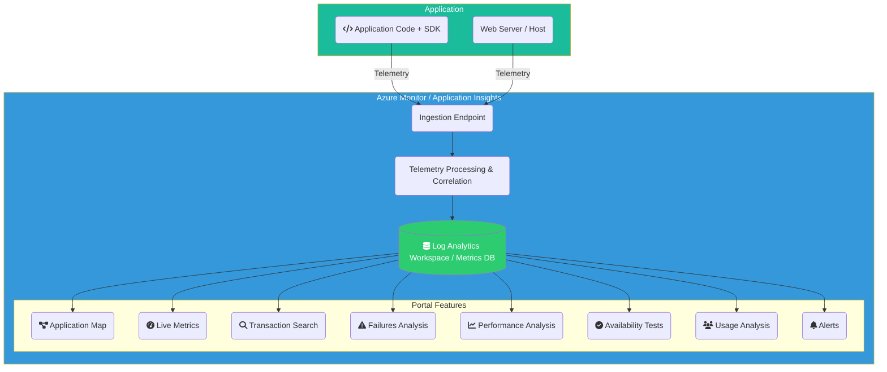
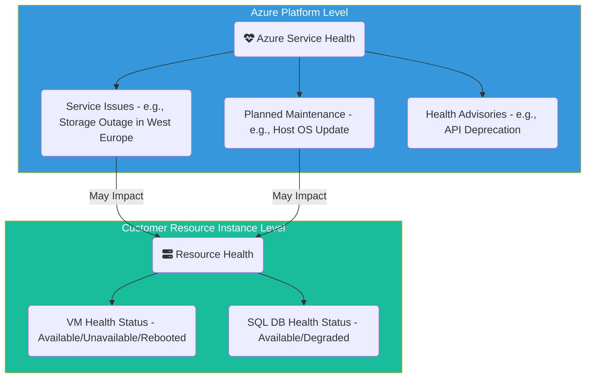

# azure-master

Okay, let's build out Section 1: Design Identity, Governance, and Monitoring Solutions for the Azure Solutions Architect Expert (AZ-305) Visual Reference guide in full detail, including explanations, diagrams using Mermaid.js syntax, and comparison tables.

---

**(Start of Section 1)**

# **Section 1: Design Identity, Governance, and Monitoring Solutions**

Section 1 of the Azure Solutions Architect Expert journey focuses on the critical foundational elements required for any secure, compliant, well-managed, and observable cloud environment. Mastering identity and access management, establishing robust governance, and implementing comprehensive monitoring are paramount before deploying significant workloads. This section covers how to translate business requirements for security, compliance, cost control, and operational visibility into effective Azure solutions using Microsoft Entra ID, Azure Policy, Azure Cost Management, and Azure Monitor.

---

## **1.1 Design Identity and Access Management (IAM)**

Designing the identity strategy is often the first step in Azure adoption. It involves managing user identities, controlling access to resources, and ensuring secure authentication and authorization mechanisms are in place. Microsoft Entra ID (formerly Azure Active Directory) is the core service for these capabilities.

### **1.1.1 Microsoft Entra ID Fundamentals**

Microsoft Entra ID is Microsoft's cloud-based identity and access management service. It helps employees sign in and access resources in external resources (like Microsoft 365, Azure portal, SaaS apps) and internal resources (like apps on your corporate network).

*   **Concepts:**
    *   **Tenant:** A dedicated and trusted instance of Microsoft Entra ID, automatically created when an organization signs up for a Microsoft cloud service subscription. It represents the organization.
    *   **Users:** Identities representing people (Members) or guests (Guest users from other tenants or consumer accounts) needing access.
    *   **Groups:** Collections of users or other principals used to simplify access management (assigning permissions to groups instead of individuals). Types include Security groups (for managing access) and Microsoft 365 groups (for collaboration features + access). Membership can be Assigned (manual) or Dynamic (rule-based based on user attributes).
    *   **Service Principals:** An identity created for applications, hosted services, and automated tools to access Azure resources. Think of it as a "user identity" (username and password or certificate) for an application.
    *   **App Registrations:** Defines an application within Entra ID, allowing it to authenticate and call APIs. Creates an Application object and a corresponding Service Principal object in the home tenant.

*   **Authentication Methods:** How users prove their identity.
    *   **Password Hash Synchronization (PHS):** (Most common for hybrid) Hashes of on-premises AD user passwords are synced to Entra ID. Users authenticate directly against Entra ID using the same password. Requires Entra Connect Sync.
    *   **Pass-Through Authentication (PTA):** User password validation happens directly against on-premises AD using lightweight agents. No password hashes stored in the cloud. Requires Entra Connect Sync and PTA agents.
    *   **Federation (e.g., ADFS):** Entra ID redirects authentication to a trusted external Identity Provider (IdP) like Active Directory Federation Services (ADFS). Requires managing a separate federation infrastructure.
    *   **Passwordless:** Methods like FIDO2 security keys, Microsoft Authenticator app sign-in, Windows Hello for Business.

*   **Multi-Factor Authentication (MFA):** Adds a layer of security by requiring two or more verification methods.
    *   **Methods:** Something you know (password), something you have (Authenticator app, token, phone call, SMS), something you are (biometrics - via Windows Hello).
    *   **Enforcement:** Can be enabled per-user (legacy, not recommended), through security defaults (basic free MFA for admins/all users), or ideally via **Conditional Access policies**.
    *   **Features:** Number Matching (prevents accidental approval), Trusted IPs/Named Locations (bypass MFA from known locations), Remember MFA on trusted devices.

*   **Conditional Access (CA) Policies:** The core policy engine in Entra ID Premium to enforce organizational access requirements. Acts as an "If-Then" statement.
    *   **Assignments (If):** Define the scope - Users/Groups, Cloud Apps, Conditions (Sign-in Risk, User Risk, Device Platform, Location, Client Apps, Device State - Compliant/Hybrid Joined).
    *   **Access Controls (Then):** Define the action - Block access, Grant access but require MFA, Compliant Device, Hybrid Joined Device, Approved Client App, App Protection Policy, Password Change, Terms of Use.

*   **Single Sign-On (SSO):** Enables users to sign in once and access multiple applications and services without re-authenticating. Entra ID acts as the central IdP. Supports SAML 2.0, OpenID Connect (OIDC), OAuth 2.0 protocols. Configured via Enterprise Applications.

**Diagram 1.1.1.A: Entra ID Tenant Structure & Authentication Flow**


**Diagram 1.1.1.B: Conditional Access Policy Logic**
```mermaid
graph TD
    Start(Sign-in Attempt) --> ConditionCheck{Evaluate Conditions?};

    subgraph Conditions [Assignments IF]
      CondUserGroup[User/Group Membership?]
      CondApp[Target Cloud App?]
      CondLocation[Location IP/GPS?]
      CondDevice[Device State Compliant/Hybrid?]
      CondClientApp[Client App Browser/Mobile/Legacy?]
      CondRisk[Sign-in/User Risk Detected?]
    end

    ConditionCheck -- Yes --> CondUserGroup;
    CondUserGroup --> CondApp;
    CondApp --> CondLocation;
    Location --> CondDevice;
    CondDevice --> CondClientApp;
    CondClientApp --> CondRisk;

    CondRisk -- Conditions Met --> ControlCheck{Evaluate Controls?};
    CondRisk -- Conditions Not Met --> AllowAccessGrant Access - No Policy Match;

    subgraph Controls [Access Controls THEN]
        direction LR
        Grant[Grant Access]
        Block[Block Access]
        subgraph Grant Requirements
            ReqMFA[Require MFA]
            ReqCompliant[Require Compliant Device]
            ReqHybrid[Require Hybrid Joined Device]
            ReqApp[Require Approved Client App]
            ReqTerms[Require Terms of Use]
            ReqPassword[Require Password Change]
        end
    end

    ControlCheck -- Grant Path --> Grant;
    Grant --> ReqMFA;
    Grant --> ReqCompliant;
    Grant --> ReqHybrid;
    Grant --> ReqApp;
    Grant --> ReqTerms;
    Grant --> ReqPassword;

    ControlCheck -- Block Path --> Block;

    ReqMFA --> AccessGrantedAccess Granted with Controls;
    ReqCompliant --> AccessGranted;
    ReqHybrid --> AccessGranted;
    ReqApp --> AccessGranted;
    ReqTerms --> AccessGranted;
    ReqPassword --> AccessGranted;
    Block --> AccessBlockedAccess Blocked;

    style Start fill:#2196F3,color:#FFF
    style AllowAccess fill:#4CAF50,color:#FFF
    style AccessGranted fill:#4CAF50,color:#FFF
    style AccessBlocked fill:#F44336,color:#FFF
```

**Comparison Table 1.1.1.C: Authentication Methods (PHS vs. PTA vs. Federation)**

| Feature             | Password Hash Sync (PHS)                     | Pass-Through Auth (PTA)                       | Federation (e.g., ADFS)                     |
| :------------------ | :------------------------------------------- | :-------------------------------------------- | :------------------------------------------ |
| **Password Storage**| Hash stored in Entra ID                      | No password/hash stored in Entra ID           | No password/hash stored in Entra ID         |
| **Validation**      | Entra ID validates hash                      | On-premises AD validates via PTA Agent        | On-premises IdP (ADFS) validates            |
| **Infrastructure**  | Entra Connect Sync                           | Entra Connect Sync + PTA Agent(s)             | Entra Connect Sync + Federation Server(s)   |
| **Complexity**      | Low                                          | Medium (Agents required)                      | High (Requires managing Federation infra)   |
| **On-Prem Dependency**| Low (Only for sync)                        | High (Agents need connectivity to DCs)        | High (Federation servers must be reachable) |
| **User Experience** | Seamless Cloud Auth                          | Seamless Cloud Auth                           | Redirect to IdP login page                  |
| **Offline Access**  | Cloud auth works if on-prem AD is down       | Cloud auth fails if Agents/DCs are down       | Cloud auth fails if IdP is down             |
| **Use Case**        | Most common, simplest hybrid identity        | Org policy prohibits password hashes in cloud | Complex security needs, existing IdP        |

### **1.1.2 Azure Role-Based Access Control (RBAC)**

Azure RBAC provides fine-grained access management for Azure resources, enabling you to grant only the amount of access that users need to perform their jobs (Principle of Least Privilege).

*   **Concepts:**
    *   **Security Principal:** An object representing a user, group, service principal, or managed identity that is requesting access to Azure resources.
    *   **Role Definition:** A collection of permissions (e.g., `Microsoft.Compute/virtualMachines/start/action`). It lists the operations that can be performed (Actions), operations that cannot be performed (NotActions), and data operations (DataActions/NotDataActions for storage, etc.). Roles can be Built-in (provided by Azure, e.g., Owner, Contributor, Reader, VM Contributor) or Custom (created by you).
    *   **Scope:** The boundary to which the access applies. Can be set at four levels: Management Group (highest), Subscription, Resource Group, or individual Resource.
    *   **Role Assignment:** The process of attaching a role definition to a security principal at a particular scope. This grants the access.

*   **Inheritance:** Permissions are inherited from parent scopes. A role assigned at a Management Group scope grants those permissions to all subscriptions, resource groups, and resources within it.
*   **Deny Assignments:** Take precedence over role assignments. Currently, only created by Azure (e.g., via Blueprints or Managed Apps) to protect resources. You cannot create custom deny assignments directly.

**Diagram 1.1.2.A: Azure RBAC Hierarchy and Inheritance**

*Note: Dashed arrows indicate inheritance. Solid arrows indicate role assignments.*

**Diagram 1.1.2.B: RBAC Assignment Components**
```mermaid
graph LR
    Principal[fa:fa-user Security Principal <br/> (User, Group, SPN, MI)]
    RoleDef[fa:fa-book Role Definition <br/> (e.g., Contributor)]
    Scope[fa:fa-crosshairs Scope <br/> (MG, Sub, RG, Resource)]

    Principal -- Is Assigned --> Assignment((fa:fa-link Role Assignment));
    RoleDef -- Defines Permissions For --> Assignment;
    Scope -- Applied At --> Assignment;

    style Principal fill:#F39C12,color:#FFF
    style RoleDef fill:#3498DB,color:#FFF
    style Scope fill:#1ABC9C,color:#FFF
    style Assignment fill:#2C3E50,color:#FFF
```

### **1.1.3 Privileged Identity Management (PIM)**

PIM is an Entra ID Premium P2 service that enables you to manage, control, and monitor access to important resources. This includes managing privileged access for roles in Entra ID and Azure resources.

*   **Concepts:**
    *   **Eligible Assignment:** User must activate the role before using it. Activation may require MFA, justification, or approval. Reduces risk of standing privileges.
    *   **Active Assignment:** Traditional role assignment, user has permissions immediately (like standard RBAC). Used less often for privileged roles with PIM.
    *   **Just-in-Time (JIT) Access:** Users get temporary permissions to perform privileged tasks only when needed.
    *   **Time-Bound Access:** Assignments (Eligible or Active) can have start and end dates.
    *   **Approval Workflows:** Require designated approvers to authorize role activation requests.
    *   **Access Reviews:** Recurrent reviews where users or designated reviewers must attest to the continued need for role assignments. Helps clean up unnecessary access.
    *   **Alerts & Audit Logs:** Provides visibility into privileged access activity and potential misuse.

*   **Use Cases:** Securely managing Global Administrators, Subscription Owners, Contributor roles, etc. Enforcing least privilege for administrative tasks. Meeting compliance requirements for privileged access control.

**Diagram 1.1.3.A: PIM Activation Workflow (Eligible Assignment)**


### **1.1.4 Managed Identities**

Managed identities provide an identity for applications to use when connecting to resources that support Microsoft Entra authentication, without needing to manage any credentials (like passwords or secrets) in code or configuration.

*   **Types:**
    *   **System-assigned:** Created as part of an Azure resource (e.g., VM, App Service, Function App). Its lifecycle is tied directly to that resource; deleting the resource deletes the identity. Cannot be shared.
    *   **User-assigned:** Created as a standalone Azure resource. Can be assigned to one or more Azure resources. Its lifecycle is managed independently. Useful for scenarios where multiple resources need the same identity or for pre-provisioning identity before resource creation.

*   **Authentication Flow:**
    1.  An Azure resource (e.g., VM) with a managed identity enabled needs to access another Azure service (e.g., Key Vault).
    2.  The resource's code requests an access token from the local Azure Instance Metadata Service (IMDS) endpoint (a non-routable IP address accessible only from within the VM/service).
    3.  IMDS communicates with Entra ID to obtain an OAuth 2.0 access token for the resource's managed identity.
    4.  IMDS returns the access token to the requesting resource.
    5.  The resource uses the obtained token in the Authorization header when calling the target Azure service API.
    6.  The target service validates the token and authorizes the request based on the RBAC roles assigned to the managed identity on that target service.

*   **Use Cases:** Securely accessing Key Vault, Storage Accounts, Azure SQL Database, Azure Resource Manager API, etc., from Azure compute services without embedding credentials.

**Diagram 1.1.4.A: Managed Identity Authentication Flow**


**Comparison Table 1.1.4.B: System-assigned vs. User-assigned Managed Identities**

| Feature         | System-assigned Managed Identity        | User-assigned Managed Identity          |
| :-------------- | :-------------------------------------- | :-------------------------------------- |
| **Creation**    | Enabled on an Azure resource instance   | Created as a standalone Azure resource  |
| **Lifecycle**   | Tied to the Azure resource              | Managed independently                   |
| **Sharing**     | Cannot be shared (1:1 with resource)    | Can be assigned to multiple resources   |
| **Use Case**    | Workloads contained within a single resource | Scenarios requiring shared identity, pre-provisioning |
| **ARM Template**| Part of the resource definition         | Separate resource definition            |

### **1.1.5 Entra ID Identity Protection**

Identity Protection is a tool that allows organizations to detect potential vulnerabilities affecting user identities, configure automated responses to detected suspicious actions, and investigate suspicious incidents. Requires Entra ID Premium P2.

*   **Risk Detection:** Uses Microsoft's intelligence (heuristics, machine learning) to detect risk signals.
    *   **User Risk:** Probability that a user account has been compromised (e.g., Leaked credentials found online, sign-ins from anomalous locations/infected devices).
    *   **Sign-in Risk:** Probability that a specific sign-in attempt is not authorized by the identity owner (e.g., Anonymous IP address, Impossible travel, Unfamiliar sign-in properties, Malware linked IP).

*   **Policies:** Automated responses integrated with Conditional Access.
    *   **User Risk Policy:** Targets users deemed "at risk". Common action: Require secure password reset.
    *   **Sign-in Risk Policy:** Targets sign-in attempts deemed "at risk". Common action: Require MFA or Block access.

*   **Reporting & Investigation:** Provides reports on risky users, risky sign-ins, and risk detections for investigation.

**Diagram 1.1.5.A: Identity Protection Risk Detection & Remediation Flow**
```mermaid
graph TD
    subgraph Detection
        Behavior(User Sign-in / Behavior) --> RiskEngine{Microsoft Threat Intelligence & ML Engine};
        RiskEngine -- Detects --> UserRisk[User Risk (e.g., Leaked Creds)];
        RiskEngine -- Detects --> SignInRisk[Sign-in Risk (e.g., Impossible Travel)];
    end

    subgraph PolicyEnforcement
        UserRisk --> UserPolicy{User Risk Policy Check};
        SignInRisk --> SignInPolicy{Sign-in Risk Policy Check};

        UserPolicy -- High Risk --> U_Remediate[Remediate User Risk (e.g., Force Password Reset via CA)];
        UserPolicy -- Medium/Low Risk --> U_Monitor[Monitor / Require MFA via CA];
        UserPolicy -- No Match --> Continue1;

        SignInPolicy -- High Risk --> S_Block[Block Sign-in via CA];
        SignInPolicy -- Medium/Low Risk --> S_Remediate[Remediate Sign-in Risk (e.g., Require MFA via CA)];
        SignInPolicy -- No Match --> Continue2;
    end

    subgraph Investigation
        UserRisk --> Reports(Reports & Investigation);
        SignInRisk --> Reports;
        U_Remediate --> Reports;
        S_Block --> Reports;
        S_Remediate --> Reports;
    end

    Continue1 --> End(Access Allowed/Further Checks);
    Continue2 --> End;
    U_Remediate --> End;
    U_Monitor --> End;
    S_Block --> End;
    S_Remediate --> End;

    style RiskEngine fill:#E74C3C, color:#FFF
    style UserPolicy fill:#3498DB, color:#FFF
    style SignInPolicy fill:#3498DB, color:#FFF
```

### **1.1.6 External Identities**

Entra ID provides capabilities to securely interact with users outside your organization.

*   **B2B Collaboration:** Allows you to invite guest users (using their own credentials from their home tenant or other IdPs) to collaborate on your organization's resources (e.g., SharePoint sites, Teams, Azure resources). Access is managed via RBAC/application permissions. Cross-tenant access settings provide granular control over inbound/outbound collaboration. Entitlement Management can bundle resources into Access Packages for streamlined B2B onboarding and governance.
*   **B2C (Azure AD B2C):** A separate Customer Identity Access Management (CIAM) service, typically run in a dedicated B2C tenant. Designed for customer-facing applications. Allows customers to sign up, sign in, and manage their profiles using local accounts (email/username + password) or social/enterprise identity providers (Facebook, Google, SAML IdPs). Highly customizable user journeys via User Flows or Custom Policies (Identity Experience Framework).

**Comparison Table 1.1.6.A: Entra ID vs. B2B vs. B2C**

| Feature             | Microsoft Entra ID (Workforce) | B2B Collaboration (Guest Users) | Azure AD B2C (Customer Identity) |
| :------------------ | :----------------------------- | :------------------------------ | :------------------------------- |
| **Primary Purpose** | Manage employee/internal access | Collaborate with external partners | Manage customer identities/access |
| **Tenant Model**    | Organization's primary tenant  | Guests exist in primary tenant  | Separate, dedicated B2C tenant   |
| **User Types**      | Members                        | Guests                          | Consumers (Local, Social, Federated) |
| **Identity Providers**| Entra ID, On-prem AD (Hybrid)  | Guest's Home Entra ID, Email OTP, Google, etc. | Local Accounts, Google, Facebook, SAML/OIDC IdPs |
| **Customization**   | Limited UI branding            | Limited UI branding             | Highly customizable UI/User Journeys |
| **Pricing**         | Per User (Free, P1, P2 tiers)  | First 50k MAU free, then tiered | Per Monthly Active User (MAU) & Authentication |
| **Use Case**        | Employee access to M365/Azure/Apps | Sharing resources with partners | Customer login for retail/public apps |

---

## **1.2 Design Governance**

Governance in Azure involves establishing policies, processes, and tools to manage resources effectively, ensure compliance, control costs, and maintain security posture across the environment.

### **1.2.1 Azure Policy**

Azure Policy helps enforce organizational standards and assess compliance at scale. It evaluates resources for non-compliance with assigned policies.

*   **Components:**
    *   **Policy Definition:** A JSON file describing resource compliance rules (e.g., allowed locations, required tags, allowed VM SKUs, required security settings). Contains the logic (if/then conditions) and the effect.
    *   **Initiative Definition (Policy Set):** A collection of related policy definitions grouped together to achieve a larger goal (e.g., "Enable Monitoring in Azure Security Center" initiative might contain policies for installing agents, enabling diagnostics, etc.). Simplifies assignment.
    *   **Assignment:** Applying a policy or initiative definition to a specific scope (Management Group, Subscription, Resource Group). Parameters can be specified during assignment (e.g., the specific tag name to enforce). A Managed Identity can be assigned for policies with `DeployIfNotExists` or `Modify` effects to grant permissions for remediation.
    *   **Exemption:** Allows specific resources or scopes to be excluded from policy evaluation for a defined reason and duration.

*   **Effects:** Determine what happens when the policy rule is matched.
    *   `Audit`: Creates a warning event in the Activity Log but doesn't stop the action. Good for assessing compliance.
    *   `AuditIfNotExists`: Audits if a related resource (e.g., diagnostic setting) doesn't exist.
    *   `Deny`: Blocks the resource creation or update action if it violates the policy.
    *   `DeployIfNotExists`: Deploys a related resource (e.g., Log Analytics agent) if it's missing after resource creation/update. Requires a Managed Identity.
    *   `Modify`: Adds or updates properties/tags on resources during creation or update (e.g., adding a cost center tag). Requires a Managed Identity.
    *   `Append`: Adds fields to a resource during creation/update (less common than Modify).
    *   `Disabled`: Disables the policy assignment.

*   **Use Cases:** Cost control (restricting expensive SKUs), Security (enforcing encryption, network rules), Compliance (meeting regulatory requirements), Tagging enforcement, Resource consistency.
*   **Policy vs. RBAC:** Policy controls *what* can be done with resources (properties, configurations), while RBAC controls *who* can perform actions on resources. They are complementary.

**Diagram 1.2.1.A: Azure Policy Enforcement Flow**


**Diagram 1.2.1.B: Policy Initiative Structure**
```mermaid
graph LR
    subgraph Initiative Definition ["fa:fa-list-alt Initiative: Enforce Security Standards"]
        PolicyDef1[fa:fa-file-alt Policy Def: Allowed Locations]
        PolicyDef2[fa:fa-file-alt Policy Def: Require NSG on Subnets]
        PolicyDef3[fa:fa-file-alt Policy Def: Enforce HTTPS on App Service]
        PolicyDef4[fa:fa-file-alt Policy Def: Audit VMs without Antimalware]
    end

    Initiative -- Assigned To --> Scope[fa:fa-crosshairs Scope (MG/Sub/RG)];

    style Initiative fill:#8E44AD,color:#FFF
    style PolicyDef1 fill:#3498DB,color:#FFF
    style PolicyDef2 fill:#3498DB,color:#FFF
    style PolicyDef3 fill:#3498DB,color:#FFF
    style PolicyDef4 fill:#3498DB,color:#FFF
    style Scope fill:#1ABC9C,color:#FFF
```

### **1.2.2 Resource Organization & Tagging**

A well-defined hierarchy and consistent tagging strategy are crucial for managing costs, applying governance policies, and organizing resources logically.

*   **Hierarchy:**
    *   **Management Groups (MGs):** Containers to organize subscriptions. Policies and RBAC assignments at the MG level are inherited by all subscriptions within it. Allows structuring based on organizational needs (e.g., Geography, Business Unit, Prod/Dev). A root MG exists above all others.
    *   **Subscriptions:** A unit of management, billing, and scale. Resources are deployed within subscriptions. Acts as a boundary for policies, RBAC, and Azure limits.
    *   **Resource Groups (RGs):** Containers holding related resources for an application or workload. Resources within an RG typically share the same lifecycle (deployed, managed, and deleted together). Resources can only exist in one RG.

*   **Subscription Design Models:** Common strategies include:
    *   **By Application:** Each major application gets its own subscription. Good isolation, clear ownership, but can lead to many subscriptions.
    *   **By Environment:** Separate subscriptions for Production, Development, Testing, Staging. Good isolation between environments.
    *   **By Business Unit:** Subscriptions aligned with organizational departments. Clear billing/chargeback.
    *   **By Geography:** For data residency or regional management needs.
    *   **Hybrid:** Combining models (e.g., BU -> Prod/Dev subscriptions).

*   **Tagging Strategy:** Applying metadata (key-value pairs) to resources for organization, cost tracking, automation, and reporting.
    *   **Common Tags:** `Environment` (Prod/Dev/Test), `CostCenter`, `Owner`, `ApplicationName`, `Project`, `DataClassification`.
    *   **Enforcement:** Use Azure Policy to require specific tags on resources or resource groups, or to inherit tags from RGs/Subscriptions (using Modify effect).
    *   **Usage:** Filtering resources in the portal, grouping costs in Azure Cost Management, triggering automation scripts.

**Diagram 1.2.2.A: Azure Resource Hierarchy (Detailed Tree Diagram)**


**Decision Tree 1.2.2.B: Choosing a Subscription Model**


### **1.2.3 Cost Management and Optimization**

Azure Cost Management + Billing provides tools to monitor, allocate, and optimize Azure costs.

*   **Tools:**
    *   **Cost Analysis:** Explore and analyze costs using various filters (Timeframe, Scope, Subscription, RG, Tag, Resource Type, etc.) and groupings. Visualize spending trends.
    *   **Budgets:** Set spending thresholds (monthly, quarterly, annually) at different scopes. Trigger alerts (email, Action Group) when thresholds are forecasted or actually met.
    *   **Alerts:** Besides budget alerts, configure alerts for credit usage, invoice thresholds, etc.
    *   **Azure Advisor:** Provides personalized recommendations for optimizing resources across Cost, Security, Reliability, Operational Excellence, and Performance. Cost recommendations include right-sizing, shutting down idle resources, purchasing Reservations/Savings Plans.
    *   **Cost Exports:** Schedule recurring exports of detailed usage/cost data to an Azure Storage account for offline analysis or integration with other tools (e.g., Power BI).

*   **Optimization Levers:** Strategies to reduce Azure spend.
    *   **Right-sizing:** Selecting appropriate VM sizes, database tiers, storage performance tiers based on actual utilization, not just peak load. Use Azure Monitor metrics and Advisor.
    *   **Decommissioning:** Identifying and deleting unused resources (unattached disks, old snapshots, idle VMs, empty RGs).
    *   **Azure Hybrid Benefit (AHB):** Use existing on-premises Windows Server and SQL Server licenses with Software Assurance (or subscriptions) to pay a reduced rate (base compute cost) for corresponding Azure services (VMs, SQL DB/MI, AKS).
    *   **Reservations:** Commit to specific Azure resources (VMs, SQL DB/MI compute, Cosmos DB RU/s, Storage capacity, Software plans, etc.) for a 1-year or 3-year term to receive significant discounts compared to pay-as-you-go. Best for stable, predictable workloads. Less flexible.
    *   **Savings Plans for Compute:** Commit to a fixed hourly spend on compute services across various regions and instance types for a 1-year or 3-year term. Discounts are automatically applied to matching usage up to the commitment. More flexible than Reservations for compute.
    *   **Spot VMs:** Utilize Azure's spare compute capacity at very large discounts (up to 90%). Workloads can be evicted with little notice, suitable for fault-tolerant, interruptible tasks (batch jobs, dev/test, stateless apps).
    *   **Storage Optimization:** Using appropriate Blob access tiers (Hot/Cool/Cold/Archive) and Lifecycle Management policies. Choosing correct redundancy levels. Cleaning up old snapshots/backups.
    *   **Scheduling:** Shutting down non-production resources (VMs, DevTest Labs) during off-hours using automation (Azure Automation, Logic Apps, VM Start/Stop solution).

**Diagram 1.2.3.A: Cost Management Workflow**
```mermaid
graph TD
    subgraph Usage & Billing
        Usage(Azure Resource Usage) --> Metering(Metering Engine)
        Metering --> Rating(Rating Engine - Applies Pricing)
        Rating --> Invoice(Monthly Invoice)
    end

    subgraph Cost Management Cycle
        CostAnalysis[fa:fa-chart-bar Cost Analysis (Portal/API)] --> Monitor(Monitor Spending Trends)
        Monitor --> Budgets[fa:fa-bullseye Set Budgets & Alerts]
        Budgets -- Threshold Met --> AlertAction[fa:fa-bell Trigger Alert / Action Group]
        Monitor --> Advisor[fa:fa-lightbulb Review Advisor Recommendations]
        Advisor --> Optimization(Implement Optimization Levers)
        Optimization --> Usage
        CostAnalysis --> Exports[fa:fa-download Schedule Cost Exports to Storage]
        Exports --> OfflineAnalysis[Offline Analysis / Power BI]
    end

    Usage --> CostAnalysis

    style Usage fill:#1ABC9C,color:#FFF
    style Invoice fill:#2C3E50,color:#FFF
    style CostAnalysis fill:#3498DB,color:#FFF
    style Budgets fill:#F39C12,color:#FFF
    style Advisor fill:#9B59B6,color:#FFF
    style Optimization fill:#4CAF50,color:#FFF
```

**Comparison Table 1.2.3.B: Reservations vs. Savings Plans vs. Spot VMs vs. AHB**

| Feature             | Reservations                                  | Savings Plans (Compute)                       | Spot VMs                                      | Azure Hybrid Benefit (AHB)                  |
| :------------------ | :-------------------------------------------- | :-------------------------------------------- | :-------------------------------------------- | :------------------------------------------ |
| **Commitment**      | 1 or 3 years (Specific VM type/region/etc.)   | 1 or 3 years (Hourly $ amount for compute)    | None (Pay current Spot price)                 | Requires eligible on-prem licenses (SA/Sub) |
| **Discount**        | High (up to 72% vs PAYG)                      | High (up to 65% vs PAYG)                      | Very High (up to 90% vs PAYG)                 | Significant (Removes OS/SQL license cost)   |
| **Flexibility**     | Lower (Scope/Instance flexibility options exist) | Higher (Applies across regions/VM families) | None (Can be evicted anytime)                 | High (Can be applied/removed)               |
| **Applies To**      | VMs, SQL, Cosmos, Storage, Software, etc.     | Most Azure Compute services (VMs, AKS, ACI, Functions Premium, App Service Dedicated) | VMs, VM Scale Sets                            | Windows Server VMs, SQL VMs/DB/MI, AKS      |
| **Use Case**        | Stable, predictable workloads                 | Dynamic compute workloads needing commitment  | Interruptible, fault-tolerant workloads       | Customers with existing eligible licenses   |
| **Risk**            | Underutilization if workload changes          | Underutilization if spend drops below commit  | Eviction risk                                 | License compliance                          |

---

## **1.3 Design Monitoring**

Azure Monitor is the unified platform for collecting, analyzing, and acting on telemetry data from Azure and on-premises environments. Effective monitoring is crucial for maintaining application health, performance, and availability.

### **1.3.1 Azure Monitor Overview**

*   **Data Sources:** Applications (via Application Insights SDK), Operating Systems (via Azure Monitor Agent), Azure Resources (Platform logs/metrics), Azure Subscription (Activity Log), Azure Tenant (Entra ID Logs), Custom Sources (APIs).
*   **Data Types:**
    *   **Metrics:** Numerical values collected at regular intervals describing some aspect of a system at a particular time (e.g., CPU %, Request Count, Latency). Stored in a time-series database.
    *   **Logs:** Event data, traces, performance data organized into records with different properties. Collected by Log Analytics. Queried using KQL. Examples: Application logs, VM event logs, Syslog, Activity Log, Diagnostic settings output.
    *   **Traces:** Distributed tracing data showing the path of a request across multiple services (collected by Application Insights).
    *   **Changes:** Information about Azure resource changes (collected in Activity Log).

*   **Core Capabilities:**
    *   **Analyze:** Query logs (Log Analytics), visualize metrics (Metrics Explorer), monitor applications (Application Insights), create interactive reports (Workbooks).
    *   **Respond:** Trigger alerts based on metrics/logs/activity log, automate actions using Action Groups (Notifications, Webhooks, Functions, Logic Apps, etc.). Autoscaling based on metrics.
    *   **Visualize:** Pin charts to Azure Dashboards, create rich reports with Workbooks, use Power BI, Grafana connectors.
    *   **Integrate:** Export data, connect to SIEM/ITSM tools.

**Diagram 1.3.1.A: Azure Monitor High-Level Architecture**


### **1.3.2 Log Analytics**

Log Analytics is the primary tool in Azure Monitor for collecting, correlating, querying, and analyzing log and performance data.

*   **Log Analytics Workspace:** The fundamental container for log data.
    *   **Design:** Consider factors like data sovereignty (workspaces are regional), access control, data retention needs, cost (pricing tiers, data ingestion/retention costs), query scope. Common models: Centralized (one workspace per region/org), Decentralized (per application/team/environment).
    *   **Access Control:** Workspace-context (permissions assigned at workspace level) vs. Resource-context (permissions inherited from resources sending data - requires resource RBAC).
    *   **Data Retention & Archive:** Configure retention period per table (or default), option to archive data beyond retention for lower cost long-term storage.

*   **Agents:**
    *   **Azure Monitor Agent (AMA):** New unified agent replacing legacy agents. Collects data based on Data Collection Rules (DCRs), offering more granular control and efficiency. Supports Windows & Linux. Collects performance counters, event logs, syslog, text logs, IIS logs, etc.
    *   **Legacy Agents:** Log Analytics Agent (MMA/OMS - Windows/Linux), Diagnostics Extension (WAD/LAD - Azure resources). Being deprecated in favor of AMA.

*   **Kusto Query Language (KQL):** Powerful read-only query language used to analyze data in Log Analytics (and other services like Data Explorer, Sentinel). Key verbs: `search`, `where` (filter), `summarize` (aggregate), `project` (select columns), `extend` (calculate columns), `join`, `render` (visualize).

**Diagram 1.3.2.A: Log Analytics Workspace Design Options**
```mermaid
graph TD
    subgraph Centralized Model
        direction LR
        WS_Central[fa:fa-database Central Log Analytics Workspace (Region A)]
        App1(App 1) --> WS_Central;
        App2(App 2) --> WS_Central;
        Infra(Infrastructure) --> WS_Central;
    end

    subgraph Decentralized Model
        direction LR
        WS_App1[fa:fa-database Workspace App 1 (Region A)]
        WS_App2[fa:fa-database Workspace App 2 (Region A)]
        WS_Infra[fa:fa-database Workspace Infra (Region A)]
        App1_Dec(App 1) --> WS_App1;
        App2_Dec(App 2) --> WS_App2;
        Infra_Dec(Infrastructure) --> WS_Infra;
    end

    style WS_Central fill:#2ECC71,color:#FFF
    style WS_App1 fill:#2ECC71,color:#FFF
    style WS_App2 fill:#2ECC71,color:#FFF
    style WS_Infra fill:#2ECC71,color:#FFF
```

**Comparison Table 1.3.2.B: Azure Monitor Agent (AMA) vs. Legacy Agents (MMA/OMS, WAD/LAD)**

| Feature             | Azure Monitor Agent (AMA)                     | Legacy Agents (MMA/OMS, WAD/LAD)              |
| :------------------ | :-------------------------------------------- | :-------------------------------------------- |
| **Configuration**   | Data Collection Rules (DCRs) - Centralized    | Agent config / Portal settings / Templates    |
| **Granularity**     | High (Specific events/counters per DCR)       | Lower (Often all or broad categories)         |
| **Destinations**    | Multiple Log Analytics Workspaces, Metrics    | Typically single LA Workspace, Storage        |
| **Extensibility**   | Designed for future extensions                | Limited                                       |
| **OS Support**      | Windows, Linux                                | Windows, Linux                                |
| **Security**        | Uses Managed Identity (recommended)           | Workspace Key / Connection Strings            |
| **Future Direction**| Strategic agent, replacing legacy agents      | Being deprecated (Aug 2024 target)            |

### **1.3.3 Application Insights**

Application Insights is an Application Performance Management (APM) service for developers and DevOps professionals. It monitors live applications, detects performance anomalies, helps diagnose issues, and understand user activity.

*   **Telemetry:** Automatically collects (via SDK instrumentation) or can be configured to collect:
    *   Request rates, response times, failure rates.
    *   Dependency rates, response times, failure rates (calls to external services like SQL, HTTP APIs).
    *   Exceptions (stack traces).
    *   Page views, load performance (browser telemetry).
    *   AJAX calls.
    *   Performance counters (CPU, Memory, etc.).
    *   Host diagnostics logs (Docker).
    *   Diagnostic trace logs (e.g., Log4Net, NLog, System.Diagnostics.Trace).
    *   Custom events and metrics coded by developers.

*   **Key Features:**
    *   **Application Map:** Visualizes the topology of application components and their dependencies, overlaying performance/failure data.
    *   **Live Metrics Stream:** Real-time view of performance and failure counts.
    *   **Transaction Search:** Find and explore individual request/dependency/exception/trace instances. End-to-end transaction details.
    *   **Failures Blade:** Analyze failed requests, exceptions, dependencies. Grouping by problem type.
    *   **Performance Blade:** Analyze response times for operations and dependencies. Identify bottlenecks.
    *   **Availability Tests:** Monitor application endpoints from global points of presence (URL ping test, Standard (multi-step) test, Custom TrackAvailability test). Trigger alerts on failure/slowness.
    *   **Usage Analysis:** Analyze user behavior (Users, Sessions, Events), create Funnels, Cohorts, User Flows, Retention reports.
    *   **Smart Detection:** Proactive automatic detection of performance and failure anomalies using machine learning.

*   **Deployment:** Typically involves adding an SDK to the application code or using codeless attach for supported services (e.g., App Service, Functions, AKS). Can be Workspace-based (sends data to Log Analytics workspace, enabling cross-querying) or Classic (standalone resource, being deprecated).

**Diagram 1.3.3.A: Application Insights Data Flow & Features**


### **1.3.4 Azure Metrics**

Azure Metrics focus on time-series data representing performance and health of resources.

*   **Types:**
    *   **Platform Metrics:** Collected automatically for Azure resources (e.g., VM CPU %, Storage Account Transactions, App Service Requests). No agent needed.
    *   **Guest OS Metrics:** Performance counters from within the VM OS (e.g., Logical Disk IOPS, Memory Available MB). Requires Azure Monitor Agent (or legacy Diagnostics Extension). Sent to Azure Monitor Metrics database (recommended) or Log Analytics/Storage.
    *   **Application Insights Metrics:** Standard metrics collected by App Insights (e.g., Server response time, Request failure rate).
    *   **Custom Metrics:** Can be sent via Application Insights SDK, Custom Metrics API, or collected from VMs via agent.

*   **Features:**
    *   **Metrics Explorer:** Primary tool for plotting charts, visual correlation, applying dimensions (filters/splitting), changing aggregation (Avg, Sum, Min, Max, Count).
    *   **Multi-dimensional Metrics:** Allow filtering and segmenting metrics by property values (e.g., filter Storage Transactions by API Name or Status Code).

*   **Use Cases:** Performance troubleshooting, capacity planning, triggering Autoscaling rules, triggering Metric Alerts.

### **1.3.5 Alerting**

Azure Monitor Alerts proactively notify you or trigger automated actions when issues are found in your infrastructure or application data.

*   **Alert Rule Types:**
    *   **Metric Alert:** Triggers when a metric value crosses a defined threshold (Static or Dynamic Thresholds). Can monitor multiple resources with one rule (using dimensions).
    *   **Log Alert (Scheduled Query):** Runs a KQL query against Log Analytics data on a schedule. Triggers based on the query results (e.g., number of results > threshold, metric measurement from query results).
    *   **Activity Log Alert:** Triggers based on events in the Azure Activity Log (e.g., Service Health events, resource creation/deletion, policy assignment changes, RBAC changes).

*   **Components:**
    *   **Alert Rule:** Defines the target resource(s), condition logic, evaluation frequency, and severity.
    *   **Condition:** The specific criteria to evaluate (e.g., `Percentage CPU > 90% for 5 minutes`, `Heartbeat missing for 10 minutes`, `Service Health event occurred`).
    *   **Action Group:** A collection of notification preferences and/or automated actions. Can be reused across multiple alert rules.
        *   **Notifications:** Email, SMS, Azure App Push Notification, Voice Call.
        *   **Actions:** Trigger Automation Runbook, Azure Function, ITSM Tool (ServiceNow, etc.), Logic App, Secure Webhook, Webhook.
    *   **Alert State:** New, Acknowledged, Closed. Metric alerts are typically stateful (fire once when threshold crossed, auto-resolve when condition clears), while Log/Activity Log alerts can be stateful or stateless.

*   **Alert Processing Rules (Preview):** Allow suppression of notifications during planned maintenance windows by applying rules to specific scopes/timeframes/filters.

**Diagram 1.3.5.A: Azure Monitor Alerting Workflow**
```mermaid
graph TD
    DataSource(fa:fa-database Metrics / Logs / Activity Log) --> AlertRule{Alert Rule Defined};
    AlertRule -- Evaluates --> Condition{Condition Logic (e.g., CPU > 90%)};
    Condition -- Threshold Met --> AlertFired(fa:fa-bell Alert State: Fired);
    AlertFired --> ActionGroup{Action Group Triggered};

    subgraph ActionGroupDetails [Action Group]
        direction LR
        Notify(Notifications: Email, SMS, Push, Voice)
        Automate(Actions: Function, Logic App, Webhook, Runbook, ITSM)
    end

    ActionGroup --> Notify;
    ActionGroup --> Automate;

    Notify --> User(fa:fa-user User / Team Notified);
    Automate --> System(fa:fa-cogs Automated Remediation / Ticketing);

    Condition -- Threshold No Longer Met (Stateful) --> AlertResolved(fa:fa-check-circle Alert State: Resolved);

    style DataSource fill:#2ECC71,color:#FFF
    style AlertRule fill:#3498DB,color:#FFF
    style AlertFired fill:#E74C3C,color:#FFF
    style ActionGroup fill:#F39C12,color:#FFF
    style AlertResolved fill:#4CAF50,color:#FFF
```

### **1.3.6 Visualization & Reporting**

Visualizing monitoring data is key to understanding trends, identifying anomalies, and sharing insights.

*   **Azure Dashboards:** Customizable canvas in the Azure portal. Can pin charts from Metrics Explorer, Log Analytics query results, Application Insights visualizations, Service Health maps, static Markdown content. Good for creating NOC/SOC views or personal status dashboards. Relatively static once created.
*   **Azure Monitor Workbooks:** Provide a flexible canvas for creating rich, interactive visual reports. Combine text, metrics charts, log queries (rendered as tables, charts, grids), parameters. Support parameterization for reusable reports across different resources/scopes. Many built-in templates available (e.g., for performance analysis, usage analysis, cost optimization). More powerful and interactive than Dashboards.
*   **Power BI:** Robust business analytics service. Can connect directly to Log Analytics workspaces to build sophisticated reports and dashboards, combining monitoring data with other business data. Requires Power BI licensing/setup.
*   **Grafana:** Popular open-source analytics and visualization platform. Azure Monitor has a data source plugin for Grafana, allowing visualization of Azure Metrics and Logs within Grafana dashboards.

**Comparison Table 1.3.6.A: Azure Dashboards vs. Azure Monitor Workbooks**

| Feature             | Azure Dashboards                          | Azure Monitor Workbooks                     |
| :------------------ | :---------------------------------------- | :------------------------------------------ |
| **Primary Use**     | NOC/SOC views, Personal status overview   | Interactive reporting, Deep analysis        |
| **Interactivity**   | Low (Basic filtering on some tiles)       | High (Parameters, Tabs, Visualizations)     |
| **Content Types**   | Pinned charts/queries, Markdown, etc.     | Text, Metrics, Logs, Parameters, Links, etc.|
| **Complexity**      | Simple to create by pinning               | More complex, richer capabilities           |
| **Sharing**         | Role-based access control                 | Role-based access control                   |
| **Templating**      | Limited (ARM templates for dashboard)     | Strong (Built-in & Custom Templates)        |
| **Data Correlation**| Visual juxtaposition                      | Rich correlation within a single report     |

### **1.3.7 Azure Service Health**

Azure Service Health provides personalized alerts and guidance when Azure service issues, planned maintenance, or health advisories affect your resources.

*   **Components:**
    *   **Service Issues:** Problems in Azure services currently affecting your resources (outages, performance degradation). Provides updates, impact details, and workarounds if available.
    *   **Planned Maintenance:** Maintenance activities scheduled by Microsoft that might impact the availability of your resources. Provides scheduling details and impact assessment.
    *   **Health Advisories:** Issues requiring you to act to avoid service interruption (e.g., service retirements, breaking changes).
    *   **Resource Health:** Provides information about the health of your *individual* resource instances (e.g., is this specific VM available? Why was it rebooted?). Complements the broader Service Health view. Accessible from the resource blade or via Service Health.

*   **Alerting:** You can configure Activity Log alerts to be notified about Service Health events relevant to your subscriptions/regions/services.

**Diagram 1.3.7.A: Service Health vs. Resource Health Scope**


---
**(End of Section 1)**
